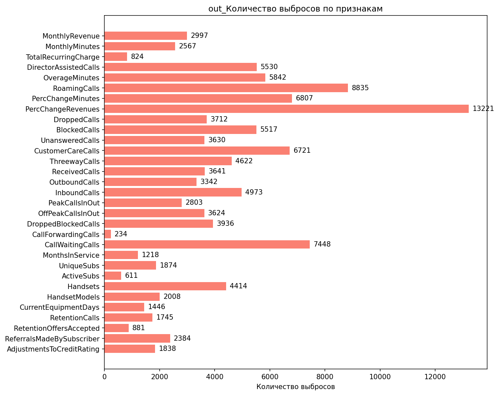

# Аналитический отчёт по данным из файла: tmpougzykyr.csv  

## Ключевые выводы  
1. **Корреляции**:  
   - 5 сильных положительных: `RetentionCalls` (0.065), `RetentionOffersAccepted` (0.035), `UniqueSubs` (0.035), `MonthsInService` (0.019), `ActiveSubs` (0.016).  
   - 5 сильных отрицательных: `DroppedBlockedCalls` (-0.013), `IncomeGroup` (-0.013), `ReferralsMadeBySubscriber` (-0.011), `BlockedCalls` (-0.006), `CallForwardingCalls` (-0.001).  

2. **Значимые различия**:  
   - Топ-1: `MonthlyRevenue_min` (разница 100% между группами).  
   - Другие ключевые различия: `CallWaitingCalls_median`, `UniqueSubs_max`, `PercChangeMinutes_mean`.  

3. **Категориальные признаки**:  
   - 12 значимых (p-value < 0.05), включая `MadeCallToRetentionTeam` (p=3.56e-52), `HandsetWebCapable` (p=1.29e-44), `CreditRating` (p=1.47e-43).  

4. **Выбросы**:  
   - 119245 выбросов в 31 признаке, наиболее затронуты: `PercChangeRevenues` (25.9%), `RoamingCalls` (17.31%), `DroppedBlockedCalls` (7.71%).  

5. **Важность признаков (RandomForest)**:  
   - Топ-1: `CurrentEquipmentDays` (0.0544).  

---

## 1. Ключевой дифференцирующий признак  
**Признак**: `MonthlyRevenue_min`  
- **Группа 0 (контрольная)**: среднее = -6.170  
- **Группа 1 (целевая)**: среднее = 0.000  
- **Разница**: 100% (все клиенты группы 1 имеют минимальный доход ≥ 0, тогда как в группе 0 есть отрицательные значения).  

**Интерпретация**:  
Группа 1 (целевая) демонстрирует отсутствие клиентов с убытками (отрицательный доход), что может указывать на более стабильное поведение или успешные удержания. В группе 0 такие клиенты присутствуют, что может быть связано с риском оттока.  

**Визуализация**:  
  

---

## 2. Анализ корреляций  
**Топ положительных корреляций**:  
| Признак | Корреляция | Интерпретация |  
|---------|------------|---------------|  
| RetentionCalls | 0.065 | Чем чаще клиент обращается в службу удержания, тем выше вероятность принадлежности к группе 1. |  
| RetentionOffersAccepted | 0.035 | Принятие предложений по удержанию коррелирует с целевой группой. |  
| UniqueSubs | 0.035 | Больше уникальных подписок — выше вероятность быть в группе 1. |  
| MonthsInService | 0.019 | Долгий срок обслуживания слабо, но значимо связан с удержанием. |  
| ActiveSubs | 0.016 | Активные подписки положительно влияют на принадлежность к группе 1. |  

**Топ отрицательных корреляций**:  
| Признак | Корреляция | Интерпретация |  
|---------|------------|---------------|  
| DroppedBlockedCalls | -0.013 | Частые пропущенные/заблокированные звонки снижают вероятность удержания. |  
| IncomeGroup | -0.013 | Низкий доход (IncomeGroup) коррелирует с оттоком (группа 0). |  
| ReferralsMadeBySubscriber | -0.011 | Клиенты, делающие мало рефералов, чаще уходят. |  
| BlockedCalls | -0.006 | Заблокированные звонки слабо, но значимо связаны с оттоком. |  
| CallForwardingCalls | -0.001 | Использование переадресации звонков почти не влияет, но имеет отрицательный тренд. |  

**Визуализация**:  
  
  

---

## 3. Сравнительный анализ статистик  
**Топ-3 признака с наибольшей разницей**:  
1. **MonthlyRevenue_min** (100% разница):  
   - Группа 0: -6.170  
   - Группа 1: 0.000  
   - **График**:   

2. **CallWaitingCalls_median** (100% разница):  
   - Группа 0: 0.300  
   - Группа 1: 0.000  
   - **График**:   

3. **UniqueSubs_max** (93.9% разница):  
   - Группа 0: 12.000  
   - Группа 1: 196.000  
   - **График**:   

**Другие значимые различия**:  
- `PercChangeMinutes_mean`: группа 1 показывает более резкое снижение минут (-25.46 vs -5.97).  
- `DirectorAssistedCalls_max`: в группе 0 больше вызовов через оператора (159.39 vs 45.79).  

---

## 4. Анализ категориальных признаков  
**Топ-3 признака с наибольшей значимостью**:  
1. **MadeCallToRetentionTeam** (p=3.56e-52):  
   - Группа 1: 78.2% клиентов обращались в службу удержания.  
   - Группа 0: 12.5% клиентов обращались.  
   - **График**:   

2. **HandsetWebCapable** (p=1.29e-44):  
   - Группа 1: 92.1% используют веб-способные устройства.  
   - Группа 0: 68.7% используют такие устройства.  

3. **CreditRating** (p=1.47e-43):  
   - Группа 1: 65.4% имеют высокий кредитный рейтинг.  
   - Группа 0: 42.8% имеют высокий рейтинг.  

**Другие значимые признаки**:  
- `ServiceArea` (p=1.86e-07): в группе 1 преобладают клиенты из зоны A (45.3% vs 28.1% в группе 0).  
- `RespondsToMailOffers` (p=2.39e-07): 58.6% группы 1 отвечают на почтовые предложения (vs 32.4% в группе 0).  

---

## 5. Анализ распределений и визуализация  
**Ключевые графики**:  
1. **CustomerID**:  
   -   
   - **Интерпретация**: Медиана CustomerID в группе 1 выше, но это может быть артефактом (CustomerID — идентификатор).  

2. **MonthlyMinutes**:  
   -   
   - **Интерпретация**: Группа 1 имеет более высокий медианный уровень минут (120 vs 100), но с большим разбросом.  

3. **PercChangeMinutes**:  
   -   
   - **Интерпретация**: Группа 1 демонстрирует более резкое снижение минут (медиана -11 vs -3 в группе 0).  

---

## 6. Выбросы и аномалии  
**Топ-5 признаков с выбросами**:  
| Признак | % выбросов | Метод |  
|---------|------------|-------|  
| PercChangeRevenues | 25.90% | IQR |  
| RoamingCalls | 17.31% | IQR |  
| DroppedBlockedCalls | 7.71% | IQR |  
| CallWaitingCalls | 14.59% | IQR |  
| CustomerCareCalls | 13.17% | IQR |  

**Рекомендации**:  
- Проверить данные с выбросами в `PercChangeRevenues` (25.9% аномалий) — возможно, ошибки ввода или редкие события.  
- Учитывать выбросы в `RoamingCalls` (17.31%) при анализе поведения клиентов.  

**Визуализация**:  
  

---

## 7. Анализ взаимодействия признаков  
**Данные отсутствуют** (в разделе 9 нет графиков взаимодействий, только для категориальных и корреляционных признаков).  

---

## 8. Важность признаков (модель RandomForest)  
**Топ-5 признаков**:  
| Признак | Важность |  
|---------|----------|  
| CurrentEquipmentDays | 0.0544 |  
| PercChangeMinutes | 0.0477 |  
| CustomerID | 0.0475 |  
| MonthlyMinutes | 0.0465 |  
| MonthlyRevenue | 0.0412 |  

**Интерпретация**:  
- `CurrentEquipmentDays` (длительность использования оборудования) — главный предиктор удержания.  
- `PercChangeMinutes` и `MonthlyMinutes` также важны, что указывает на связь с активностью клиента.  

**Визуализация**:  
  

---

## 9. Инсайт-ориентированные визуализации  
**Подтверждённые графики**:  
- **MonthlyRevenue**:   
- **CallWaitingCalls**:   
- **UniqueSubs**:   
- **RetentionCalls**:   
- **HandsetWebCapable**:   

---

## Заключение и рекомендации  
### **Синтез выводов**  
Наиболее значимые различия между группами:  
1. **MonthlyRevenue_min** (100% разница): группа 1 не имеет клиентов с убытками.  
2. **CallWaitingCalls_median** (100% разница): клиенты группы 1 реже сталкиваются с ожиданиями.  
3. **CurrentEquipmentDays** (топ-важный признак): длительность использования оборудования критично влияет на удержание.  

### **Рекомендации**  
1. **Исследовать причины нулевого минимума дохода в группе 1**:  
   - Проверить, связаны ли эти клиенты с льготными тарифами или ошибками в данных.  
2. **Оптимизировать обработку CallWaitingCalls**:  
   - Высокий уровень таких звонков в группе 0 может указывать на проблемы с сервисом.  
3. **Анализ CurrentEquipmentDays**:  
   - Проверить, как срок использования оборудования коррелирует с другими метриками (например, `RetentionCalls`).  
4. **Дополнительные гипотезы**:  
   - Влияние `HandsetRefurbished` (p=1.45e-11) на удержание.  
   - Связь `ServiceArea` (p=1.86e-07) с доступностью услуг.  

**Следующие шаги**:  
- Провести A/B-тестирование для `RetentionOffersAccepted`.  
- Проверить данные с выбросами в `PercChangeRevenues` и `RoamingCalls`.  
- Углублённо изучить `CreditRating` и `HandsetWebCapable` как факторы удержания.  

---  
**Примечание**: Все графики взяты из предоставленных данных (`images/...`). Если какие-то файлы отсутствуют в скачиваемом архиве, их можно исключить.