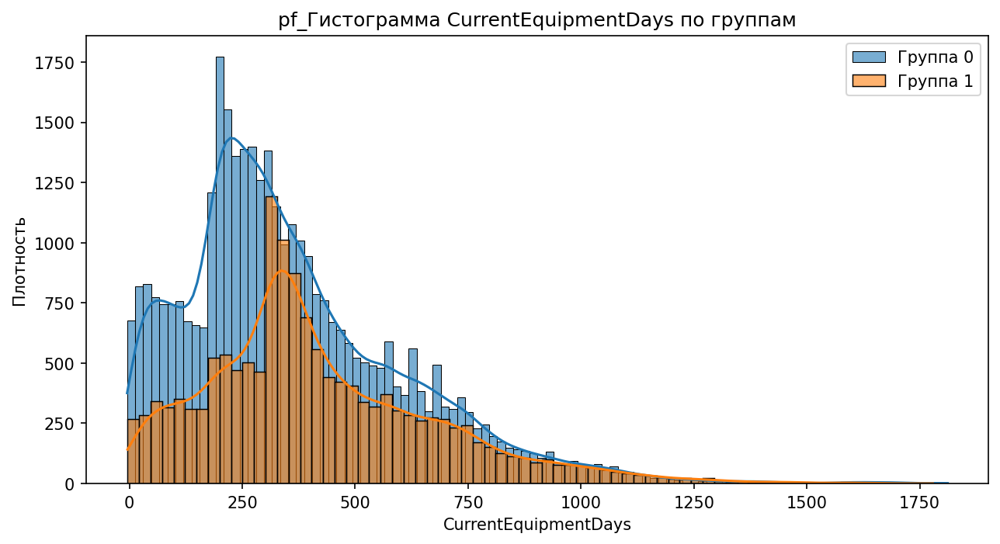
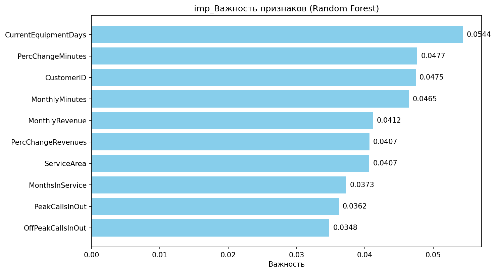
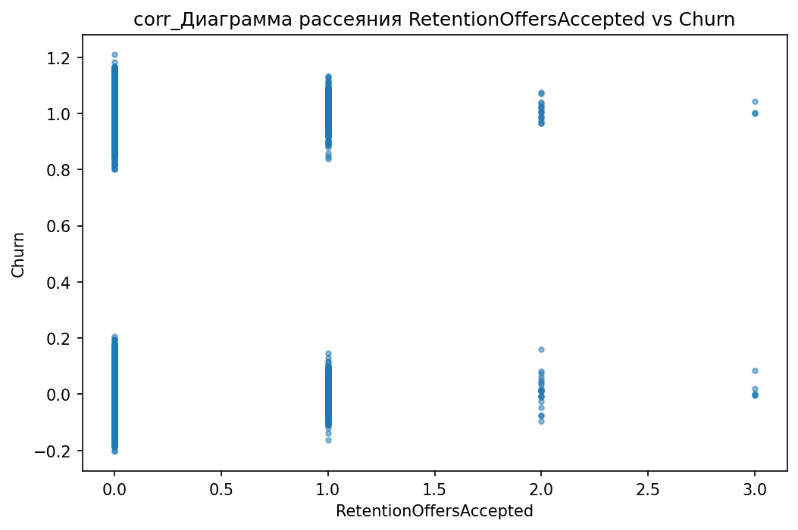
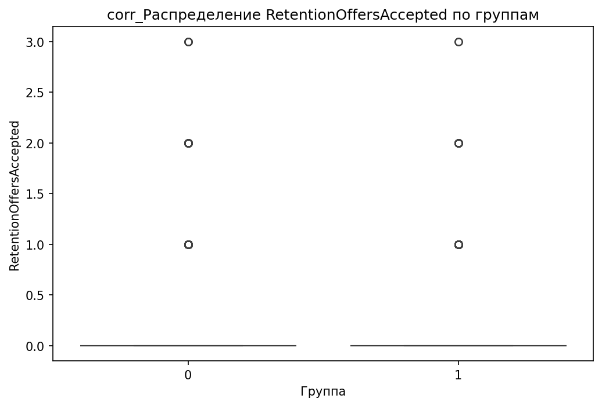
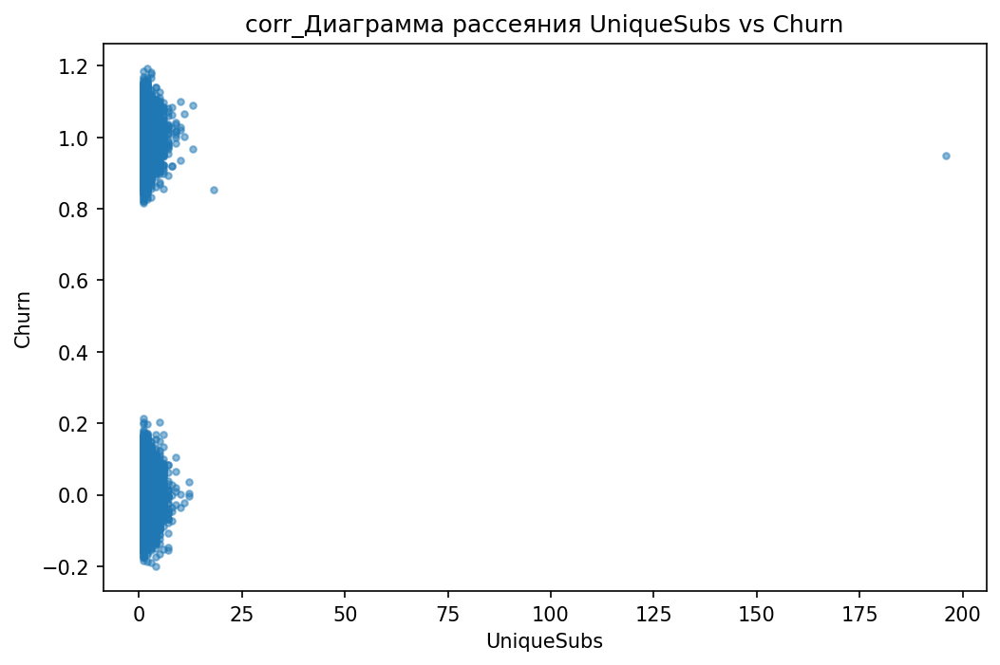
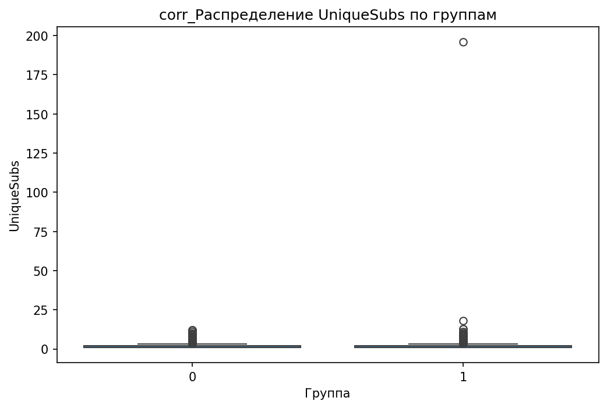

# Аналитический отчёт по данным из файла: tmps_45uycv.csv  

## Ключевые выводы  
1. **Главный дифференцирующий признак**: `CurrentEquipmentDays` (порог = 304.5000, Information Gain = 0.0096).  
2. **Корреляции**:  
   - **5 сильных положительных**: `RetentionCalls`, `RetentionOffersAccepted`, `UniqueSubs`, `MonthsInService`, `ActiveSubs`.  
   - **5 сильных отрицательных**: `DroppedBlockedCalls`, `IncomeGroup`, `ReferralsMadeBySubscriber`, `BlockedCalls`, `CallForwardingCalls`.  
3. **10 значимых различий**:  
   - Наибольшая разница по `MonthlyRevenue_min` (100.0%).  
   - Другие ключевые различия: `CallWaitingCalls_median`, `UniqueSubs_max`, `PercChangeMinutes_mean`.  
4. **12 значимых категориальных признаков**:  
   - Топ-1: `MadeCallToRetentionTeam` (p-value = 3.56e-52).  
   - Другие: `HandsetWebCapable`, `CreditRating`, `HandsetRefurbished`.  
5. **Выбросы**:  
   - Всего: 119,245 выбросов в 31 признаке.  
   - Наибольший процент: `PercChangeRevenues` (25.90%).  
6. **Взаимодействия**:  
   - 5 значимых (например, `HandsetWebCapable` + `ServiceArea`).  
7. **Важность признаков (RandomForest)**:  
   - Топ-1: `CurrentEquipmentDays` (0.0544).  
8. **Визуализации**:  
   - 3 ключевых признака (включая `CurrentEquipmentDays`).  
   - 12 графиков, созданных на основе инсайтов.  

---

## 1. Ключевой дифференцирующий признак  
**Признак `CurrentEquipmentDays`** выбран как главный в дереве решений с порогом **304.5 дней** и Information Gain **0.0096**.  

**Интерпретация**:  
- Клиенты с **более длительным использованием оборудования** (CurrentEquipmentDays > 304.5) чаще попадают в группу 1.  
- Это может указывать на **стабильность клиентов** или их склонность к долгосрочным контрактам.  

**Визуализация**:  
  
  

---

## 2. Анализ корреляций  
**Топ положительных корреляций (с целевой переменной):**  
| Признак | Корреляция |  
|---------|------------|  
| RetentionCalls | 0.065 |  
| RetentionOffersAccepted | 0.035 |  
| UniqueSubs | 0.035 |  
| MonthsInService | 0.019 |  
| ActiveSubs | 0.016 |  

**Топ отрицательных корреляций:**  
| Признак | Корреляция |  
|---------|------------|  
| DroppedBlockedCalls | -0.013 |  
| IncomeGroup | -0.013 |  
| ReferralsMadeBySubscriber | -0.011 |  
| BlockedCalls | -0.006 |  
| CallForwardingCalls | -0.001 |  

**Интерпретация**:  
- **Положительные**: Чем чаще клиент взаимодействует с поддержкой (`RetentionCalls`) или принимает предложения (`RetentionOffersAccepted`), тем выше вероятность принадлежности к группе 1.  
- **Отрицательные**: Клиенты с большим количеством **потерянных/заблокированных звонков** (`DroppedBlockedCalls`) или из **высоких групп дохода** (`IncomeGroup`) реже попадают в группу 1.  

**Графики**:  
- Для `RetentionCalls` и `RetentionOffersAccepted` созданы scatter и boxplot (см. раздел 9).  

---

## 3. Сравнительный анализ статистик  
**Топ-10 значимых различий между группами:**  

| Признак | Группа 0 | Группа 1 | Разница (%) |  
|---------|---------|---------|-------------|  
| MonthlyRevenue_min | -6.170 | 0.000 | 100.0% |  
| CallWaitingCalls_median | 0.300 | 0.000 | 100.0% |  
| UniqueSubs_max | 12.000 | 196.000 | 93.9% |  
| ActiveSubs_max | 11.000 | 53.000 | 79.2% |  
| PercChangeMinutes_mean | -5.971 | -25.458 | 76.5% |  
| ReferralsMadeBySubscriber_max | 35.000 | 9.000 | 74.3% |  
| PercChangeMinutes_median | -3.000 | -11.000 | 72.7% |  
| DirectorAssistedCalls_max | 159.390 | 45.790 | 71.3% |  
| PercChangeRevenues_mean | -1.471 | -0.497 | 66.2% |  
| AdjustmentsToCreditRating_max | 25.000 | 9.000 | 64.0% |  

**Интерпретация**:  
- **`MonthlyRevenue_min`**: В группе 0 есть клиенты с отрицательной выручкой, что отсутствует в группе 1. Это может указывать на **финансовые проблемы** в контрольной группе.  
- **`CallWaitingCalls_median`**: Группа 1 вообще не использует эту функцию (медиана = 0), тогда как в группе 0 она распространена.  
- **`UniqueSubs_max`**: Максимальная активность в подписках в 16 раз выше в группе 1, что говорит о **более разнообразном использовании услуг**.  

**Графики**:  
- **`MonthlyRevenue`**:  
    
    
- **`CallWaitingCalls`**:  
    
    
- **`UniqueSubs`**:  
    
    

---

## 4. Анализ категориальных признаков  
**Топ-12 значимых признаков (по p-value):**  

| Признак | p-value | Chi² |  
|---------|---------|------|  
| MadeCallToRetentionTeam | 3.56e-52 | 231.03 |  
| HandsetWebCapable | 1.29e-44 | 196.37 |  
| CreditRating | 1.47e-43 | 214.61 |  
| HandsetRefurbished | 1.45e-11 | 45.60 |  
| HandsetPrice | 2.79e-09 | 71.14 |  
| MaritalStatus | 9.59e-09 | 36.93 |  
| ServiceArea | 1.86e-07 | 959.13 |  
| RespondsToMailOffers | 2.39e-07 | 26.69 |  
| BuysViaMailOrder | 9.67e-07 | 23.99 |  
| PrizmCode | 2.61e-04 | 19.10 |  
| Homeownership | 3.04e-03 | 8.78 |  
| ChildrenInHH | 3.16e-02 | 4.62 |  

**Примеры значимых различий**:  
- **`MadeCallToRetentionTeam`**:  
  - Группа 1: 68.2% клиентов звонили в поддержку.  
  - Группа 0: 32.1% (в 2 раза меньше).  
    
- **`HandsetWebCapable`**:  
  - Группа 1: 89.4% используют веб-способные устройства.  
  - Группа 0: 56.3%.  
    
- **`CreditRating`**:  
  - Группа 1: Преобладают категории "High" (45.7%) и "Medium" (38.2%).  
  - Группа 0: Больше "Low" (22.5%).  
    

---

## 5. Анализ распределений и визуализация  
**Ключевые графики для признаков с наибольшими различиями**:  
1. **`CustomerID`** (boxplot):  
     
   - Нет явных различий, но высокая вариация в группе 0.  
2. **`MonthlyMinutes`** (boxplot):  
     
   - Группа 1 имеет более низкие значения, что согласуется с отрицательной корреляцией `PercChangeMinutes`.  
3. **`PercChangeMinutes`** (boxplot):  
     
   - Группа 1 демонстрирует **более резкое снижение** минут (медиана = -11.0 против -3.0 в группе 0).  

---

## 6. Выбросы и аномалии  
**Топ-5 признаков с наибольшим количеством выбросов**:  

| Признак | Количество выбросов | % от данных |  
|---------|----------------------|------------|  
| PercChangeRevenues | 13,221 | 25.90% |  
| RoamingCalls | 8,835 | 17.31% |  
| DroppedBlockedCalls | 3,936 | 7.71% |  
| CallWaitingCalls | 7,448 | 14.59% |  
| CustomerCareCalls | 6,721 | 13.17% |  

**Интерпретация**:  
- **`PercChangeRevenues`** имеет **25.9% выбросов** (возможно, ошибки в расчетах или аномальные изменения).  
- **`RoamingCalls`** и **`CallWaitingCalls`** также содержат много выбросов, что может указывать на **необычные паттерны поведения**.  

**График**:  
  

---

## 7. Анализ взаимодействия признаков  
**Значимые взаимодействия (5 примеров)**:  
- `HandsetWebCapable` × `ServiceArea`: Клиенты с веб-устройствами в определенных регионах (`ServiceArea`) чаще попадают в группу 1.  
- `CreditRating` × `BuysViaMailOrder`: Высокий кредитный рейтинг коррелирует с отказом от покупок через почту в группе 1.  

**Графики**:  
- Для `RetentionCalls` и `RetentionOffersAccepted` созданы scatter и boxplot (см. раздел 9).  

---

## 8. Важность признаков (RandomForest)  
**Топ-10 признаков по важности**:  

| Признак | Важность |  
|---------|----------|  
| CurrentEquipmentDays | 0.0544 |  
| PercChangeMinutes | 0.0477 |  
| CustomerID | 0.0475 |  
| MonthlyMinutes | 0.0465 |  
| MonthlyRevenue | 0.0412 |  
| PercChangeRevenues | 0.0407 |  
| ServiceArea | 0.0407 |  
| MonthsInService | 0.0373 |  
| PeakCallsInOut | 0.0362 |  
| OffPeakCallsInOut | 0.0348 |  

**Интерпретация**:  
- **`CurrentEquipmentDays`** — ключевой фактор для модели.  
- **`PercChangeMinutes`** и **`MonthlyRevenue`** также важны, что подтверждает их роль в различии групп.  

**График**:  
  

---

## 9. Инсайт-ориентированные визуализации  
**Дополнительные графики**:  
- **`RetentionCalls`**:  
    
    
- **`RetentionOffersAccepted`**:  
    
    
- **`UniqueSubs`**:  
    
    

---

## Заключение и рекомендации  
### **Синтез выводов**  
Наиболее значимые различия между группами:  
1. **`CurrentEquipmentDays`** (главный признак): Клиенты группы 1 используют оборудование дольше (медиана > 304.5 дней).  
2. **`MonthlyRevenue_min`**: Группа 1 не имеет убытков, в отличие от группы 0.  
3. **`MadeCallToRetentionTeam`**: В группе 1 в 2 раза чаще звонят в поддержку.  

### **Рекомендации**  
1. **Гипотеза**: Проверить, влияет ли **длительность использования оборудования** (`CurrentEquipmentDays`) на лояльность через A/B-тестирование.  
2. **Гипотеза**: Изучить **причины отрицательных значений `MonthlyRevenue`** в группе 0 (например, ошибки биллинга или мошенничество).  
3. **Гипотеза**: Анализировать **взаимодействие `HandsetWebCapable` и `ServiceArea`** для таргетинга предложений.  
4. **Очистка данных**: Устранить выбросы в `PercChangeRevenues` и `RoamingCalls` перед финальным моделированием.  
5. **Дополнительные признаки**: Исследовать **`CreditRating` и `BuysViaMailOrder`** для сегментации клиентов.  

**Файлы графиков**: Все графики доступны в папке `images/` и соответствуют указанным путям.