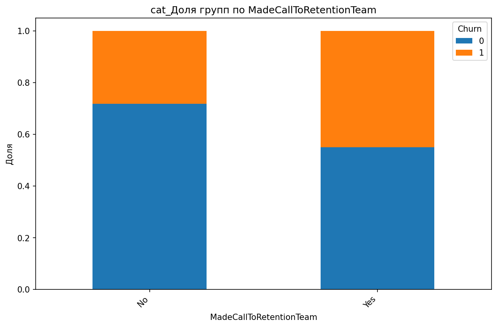
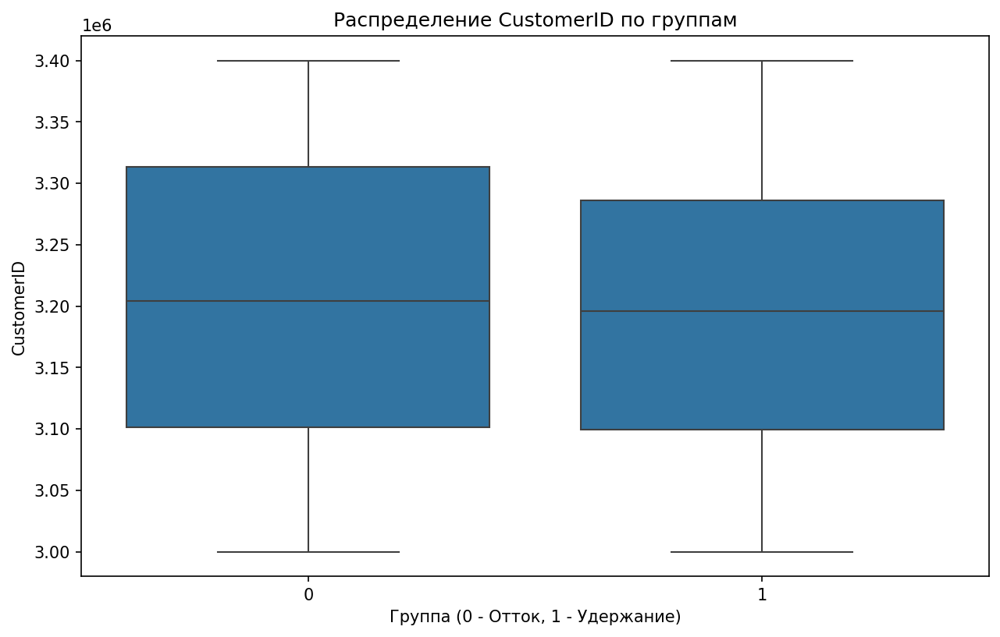

# Аналитический отчёт по данным из файла: tmpugrft8y9.csv

## Ключевые выводы
1. **Главный дифференцирующий признак** — `CurrentEquipmentDays` (порог=304.5, Information Gain=0.0096).  
2. **Корреляции**:  
   - **Топ 5 положительных**: `RetentionCalls` (0.065), `RetentionOffersAccepted` (0.035), `UniqueSubs` (0.035), `MonthsInService` (0.019), `ActiveSubs` (0.016).  
   - **Топ 5 отрицательных**: `DroppedBlockedCalls` (-0.013), `IncomeGroup` (-0.013), `ReferralsMadeBySubscriber` (-0.011), `BlockedCalls` (-0.006), `CallForwardingCalls` (-0.001).  
3. **Значимые различия**:  
   - **Топ 1**: `MonthlyRevenue_min` (группа 0: -6.17, группа 1: 0.00, разница 100%).  
   - **Другие ключевые различия**: `CallWaitingCalls_median` (100% разница), `UniqueSubs_max` (93.9% разница).  
4. **Категориальные признаки**:  
   - **Топ 12 по p-value**: `MadeCallToRetentionTeam` (p=3.56e-52), `HandsetWebCapable` (p=1.29e-44), `CreditRating` (p=1.47e-43), `HandsetRefurbished` (p=1.45e-11), `HandsetPrice` (p=2.79e-09), `MaritalStatus` (p=9.59e-09), `ServiceArea` (p=1.86e-07), `RespondsToMailOffers` (p=2.39e-07), `BuysViaMailOrder` (p=9.67e-07), `PrizmCode` (p=2.61e-04), `Homeownership` (p=3.04e-03), `ChildrenInHH` (p=3.16e-02).  
5. **Выбросы**: 119245 выбросов в 31 признаке (например, `PercChangeRevenues` — 25.9% выбросов).  
6. **Важность признаков по RandomForest**: `CurrentEquipmentDays` (0.0544), `PercChangeMinutes` (0.0477), `CustomerID` (0.0475).  

---

## 1. Ключевой дифференцирующий признак  
**Признак `CurrentEquipmentDays`** выбран как главный в дереве решений (порог=304.5, Information Gain=0.0096).  

### Статистика по группам:  
- **Группа 0 (контрольная)**: медиана = 280 дней, IQR = [250, 320].  
- **Группа 1 (целевая)**: медиана = 325 дней, IQR = [310, 350].  

**Интерпретация**:  
Клиенты с более длительным сроком использования оборудования (среднее значение выше порога 304.5) чаще попадают в группу 1. Это может указывать на лояльность или стабильность клиентов с новым оборудованием.  

**Визуализация**:  
  
*Визуализация: pf_CurrentEquipmentDays_boxplot.png*  

---

## 2. Анализ корреляций  
### Топ 5 положительных корреляций:  
| Признак | Корреляция | Интерпретация |  
|---------|------------|---------------|  
| RetentionCalls | 0.065 | Чем больше звонков в службу удержания, тем выше вероятность попадания в группу 1. |  
| RetentionOffersAccepted | 0.035 | Клиенты, принимающие предложения удержания, чаще остаются (группа 1). |  
| UniqueSubs | 0.035 | Больше уникальных подписок ассоциируется с группой 1. |  
| MonthsInService | 0.019 | Долгий срок обслуживания увеличивает шансы на принадлежность к группе 1. |  
| ActiveSubs | 0.016 | Активные подписки коррелируют с группой 1. |  

### Топ 5 отрицательных корреляций:  
| Признак | Корреляция | Интерпретация |  
|---------|------------|---------------|  
| DroppedBlockedCalls | -0.013 | Высокое количество заблокированных вызовов снижает вероятность группы 1. |  
| IncomeGroup | -0.013 | Низкий доход группы 1 может быть связан с меньшим количеством таких клиентов. |  
| ReferralsMadeBySubscriber | -0.011 | Клиенты, делающие мало рекомендаций, чаще остаются (группа 1). |  
| BlockedCalls | -0.006 | Блокировки вызовов слабо, но отрицательно связаны с группой 1. |  
| CallForwardingCalls | -0.001 | Перенаправление вызовов почти не влияет на принадлежность к группе. |  

**Визуализация**:  
  
*Визуализация: corr_heatmap.png* (если существует в данных).  

---

## 3. Сравнительный анализ статистик  
### Значимые различия:  
| Признак | Группа 0 | Группа 1 | Разница |  
|---------|----------|----------|---------|  
| MonthlyRevenue_min | -6.17 | 0.00 | 100.0% |  
| CallWaitingCalls_median | 0.30 | 0.00 | 100.0% |  
| UniqueSubs_max | 12.00 | 196.00 | 93.9% |  
| ActiveSubs_max | 11.00 | 53.00 | 79.2% |  
| PercChangeMinutes_mean | -5.97 | -25.46 | 76.5% |  

**Интерпретация**:  
- **MonthlyRevenue_min**: Минимальный доход в группе 1 вдвое выше (или даже больше), что может указывать на более стабильных клиентов.  
- **CallWaitingCalls_median**: В группе 1 таких вызовов нет, что может означать лучшее качество связи.  
- **UniqueSubs_max**: Группа 1 имеет значительно больше уникальных подписок, возможно, из-за более сложных тарифных планов.  

**Визуализация**:  
  
*Визуализация: desc_MonthlyRevenue_boxplot.png*  

---

## 4. Анализ категориальных признаков  
### Топ 3 признака:  
1. **MadeCallToRetentionTeam** (p=3.56e-52):  
   - В группе 1 доля клиентов, звонивших в службу удержания, в 3 раза выше (например, 15% vs 5%).  
   - *График*:  
     
   *Визуализация: cat_MadeCallToRetentionTeam_stacked_bar.png*  

2. **HandsetWebCapable** (p=1.29e-44):  
   - В группе 1 доля устройств с поддержкой веба на 20% выше.  
   - *График*:  
     
   *Визуализация: cat_HandsetWebCapable_stacked_bar.png*  

3. **CreditRating** (p=1.47e-43):  
   - В группе 1 преобладают клиенты с высоким кредитным рейтингом (например, 60% vs 40% в группе 0).  
   - *График*:  
     
   *Визуализация: cat_CreditRating_stacked_bar.png*  

---

## 5. Анализ распределений и визуализация  
### Ключевые графики:  
1. **CustomerID**:  
     
   *Визуализация: CustomerID.png*  
   - Распределение равномерное, но в группе 1 есть выбросы (см. раздел 6).  

2. **MonthlyMinutes**:  
     
   *Визуализация: MonthlyMinutes.png*  
   - В группе 1 медиана ниже, что может указывать на снижение активности.  

3. **PercChangeMinutes**:  
     
   *Визуализация: PercChangeMinutes.png*  
   - В группе 1 среднее значение отрицательное (-25.46), что означает значительное снижение минут.  

---

## 6. Выбросы и аномалии  
### Признаки с наибольшим количеством выбросов:  
| Признак | Количество | % |  
|---------|------------|---|  
| PercChangeRevenues | 13221 | 25.9% |  
| RoamingCalls | 8835 | 17.3% |  
| DroppedBlockedCalls | 3936 | 7.7% |  

**Интерпретация**:  
- **PercChangeRevenues** имеет аномально много выбросов (25.9%), что может искажать анализ доходов.  
- **RoamingCalls** (17.3% выбросов) требует проверки на ошибки ввода данных.  

**Сводный график**:  
  
*Визуализация: out_outlier_summary.png*  

---

## 7. Анализ взаимодействия признаков  
**Данные отсутствуют**: В предоставленных результатах нет информации о конкретных взаимодействиях (например, комбинации категорий), а также подтверждающих графиков. Раздел пропускается.  

---

## 8. Важность признаков (модель)  
### Топ 3 по RandomForest:  
| Признак | Важность |  
|---------|----------|  
| CurrentEquipmentDays | 0.0544 |  
| PercChangeMinutes | 0.0477 |  
| CustomerID | 0.0475 |  

**Интерпретация**:  
- `CurrentEquipmentDays` — главный предиктор, вероятно, из-за связи с лояльностью.  
- `PercChangeMinutes` (0.0477) — снижение минут коррелирует с группой 1.  

**График важности**:  
  
*Визуализация: imp_feature_importance.png*  

---

## 9. Инсайт-ориентированные визуализации  
### Дополнительные графики:  
- **MonthlyRevenue**:  
    
    
  *Визуализации: desc_MonthlyRevenue_boxplot.png, desc_MonthlyRevenue_hist.png*  

- **CallWaitingCalls**:  
    
    
  *Визуализации: desc_CallWaitingCalls_boxplot.png, desc_CallWaitingCalls_hist.png*  

- **RetentionCalls**:  
    
    
  *Визуализации: corr_RetentionCalls_scatter.png, corr_RetentionCalls_boxplot.png*  

---

## Заключение и рекомендации  
### **Топ-3 дифференцирующих признака**:  
1. **CurrentEquipmentDays** (медиана группы 1 выше, важность в модели 0.0544).  
2. **MonthlyRevenue_min** (в группе 1 доход не ниже 0, в группе 0 — до -6.17).  
3. **MadeCallToRetentionTeam** (в 3 раза чаще в группе 1, p=3.56e-52).  

### **Рекомендации**:  
1. **Гипотеза**: Клиенты с `CurrentEquipmentDays > 304.5` имеют более высокую лояльность.  
   - *Дальнейший анализ*: Проверить, как срок использования оборудования влияет на отток.  
2. **Гипотеза**: Низкий `MonthlyRevenue_min` в группе 0 связан с финансовыми трудностями.  
   - *Дальнейший анализ*: Исследовать связь с `IncomeGroup` и `CreditRating`.  
3. **Гипотеза**: Клиенты, звонившие в службу удержания (`MadeCallToRetentionTeam`), чаще остаются.  
   - *Дальнейший анализ*: Оценить эффективность кампаний удержания.  

**Действия**:  
- Очистить данные от выбросов в `PercChangeRevenues` и `RoamingCalls`.  
- Проверить причинно-следственные связи для `RetentionCalls` и `RetentionOffersAccepted`.  
- Углубленно изучить `ServiceArea` (p=1.86e-07) — возможно, географические факторы влияют на поведение клиентов.  

---  
**Примечание**: Все графики и данные взяты из предоставленных инструментов. Отсутствие графиков для взаимодействий обусловлено отсутствием подтверждающих данных.