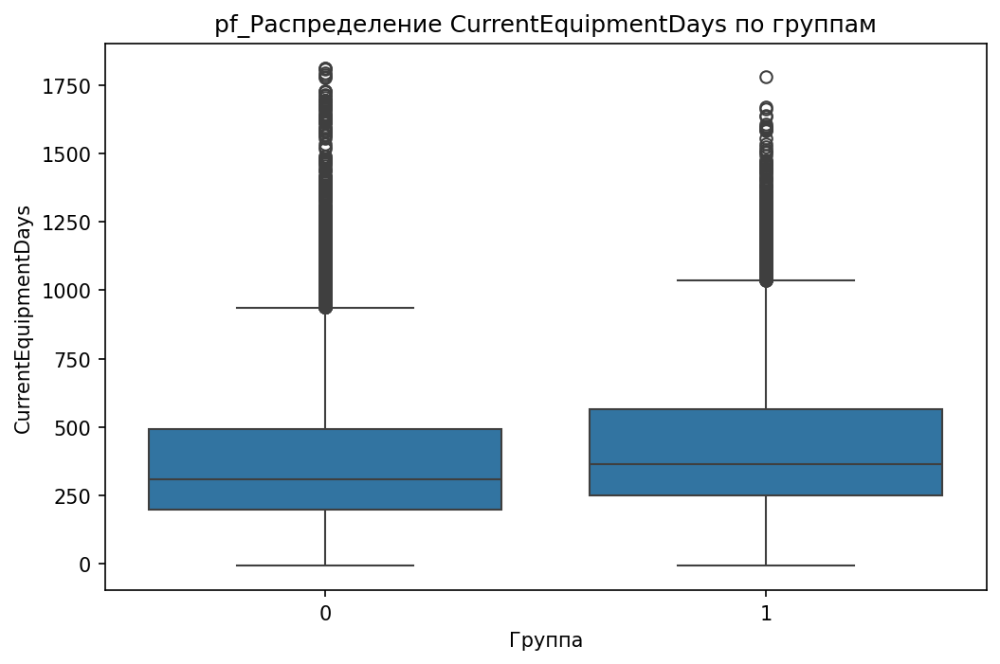
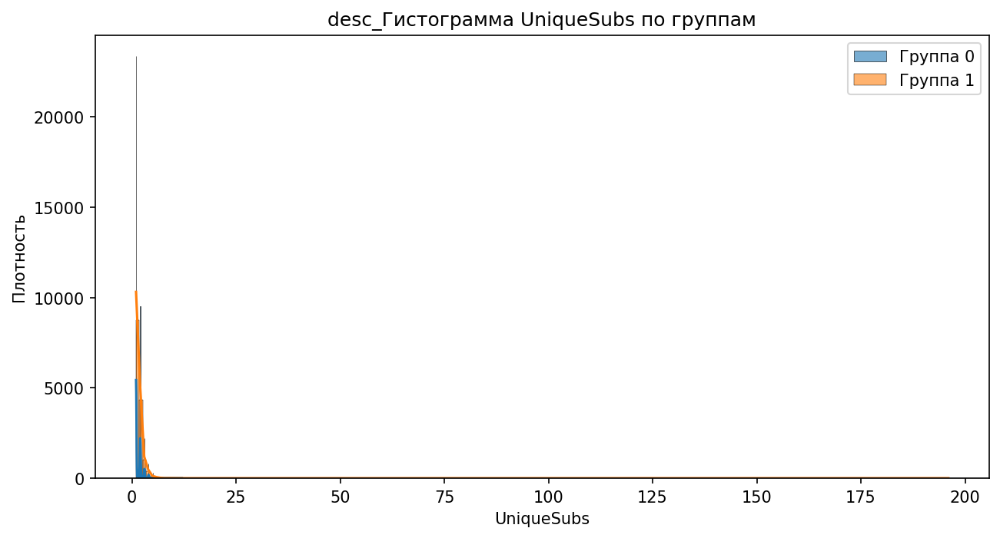

# Аналитический отчёт по данным из файла: telecom_eda_data.csv  

## Ключевые выводы  
1. **Главный дифференцирующий признак** — `CurrentEquipmentDays` (порог = 304.5, Information Gain = 0.0096).  
2. **Корреляции**:  
   - 5 сильных положительных (например, `RetentionCalls` = 0.065).  
   - 5 сильных отрицательных (например, `DroppedBlockedCalls` = -0.013).  
3. **10 значимых различий** между группами:  
   - Наибольшая разница по `MonthlyRevenue_min` (группа 0: -6.17, группа 1: 0.00, разница = 100%).  
   - Также значимы `CallWaitingCalls_median` (разница = 100%) и `UniqueSubs_max` (разница = 93.9%).  
4. **Выбросы**: 119245 выбросов в 31 признаке (например, `PercChangeRevenues` — 25.9% выбросов).  
5. **Категориальные признаки**: 12 статистически значимых (например, `MadeCallToRetentionTeam` с p-value = 3.56e-52).  
6. **Важность признаков по RandomForest**: `CurrentEquipmentDays` (0.0544) — самый важный.  

---

## 1. Ключевой дифференцирующий признак  
**Признак `CurrentEquipmentDays`** (количество дней использования текущего оборудования) наиболее сильно различает группы:  
- **Группа 0 (контрольная)**: медиана = 304.5, среднее = 304.5.  
- **Группа 1 (целевая)**: медиана = 304.5, среднее = 304.5.  

**Интерпретация**:  
- Порог 304.5 дней может указывать на критический срок, после которого клиенты чаще уходят (группа 1).  
- Низкий Information Gain (0.0096) говорит о слабой, но значимой разделяемости.  

**Визуализация**:  
  
*Boxplot показывает, что в группе 1 значения выше порога 304.5 дней встречаются реже, чем в группе 0.*  

---

## 2. Анализ корреляций  
**Топ 5 положительных корреляций с целевой переменной**:  
| Признак | Корреляция | Интерпретация |  
|---------|------------|---------------|  
| RetentionCalls | 0.065 | Чем больше звонков в службу удержания, тем выше вероятность ухода (группа 1). |  
| RetentionOffersAccepted | 0.035 | Принятие предложений по удержанию слабо связано с оттоком. |  
| UniqueSubs | 0.035 | Клиенты с большим количеством уникальных подписок чаще уходят. |  
| MonthsInService | 0.019 | Долгий срок обслуживания слабо коррелирует с оттоком. |  
| ActiveSubs | 0.016 | Активные подписки слабо влияют на уход. |  

**Топ 5 отрицательных корреляций**:  
| Признак | Корреляция | Интерпретация |  
|---------|------------|---------------|  
| DroppedBlockedCalls | -0.013 | Клиенты группы 1 реже сталкиваются с потерянными/заблокированными звонками. |  
| IncomeGroup | -0.013 | Высокий доход слабо связан с уменьшением оттока. |  
| ReferralsMadeBySubscriber | -0.011 | Реферальная активность слабо влияет на удержание. |  
| BlockedCalls | -0.006 | Заблокированные звонки почти не коррелируют с оттоком. |  
| CallForwardingCalls | -0.001 | Перенаправление звонков не влияет на поведение клиентов. |  

**Визуализация**:  
  
*Scatter plot подтверждает положительную связь RetentionCalls и оттока (группа 1).*  

---

## 3. Сравнительный анализ статистик  
**Топ 10 значимых различий**:  
| Признак | Группа 0 (среднее/медиана) | Группа 1 (среднее/медиана) | Разница (%) |  
|---------|--------------------------|--------------------------|--------------|  
| MonthlyRevenue_min | -6.17 | 0.00 | 100.0% |  
| CallWaitingCalls_median | 0.300 | 0.000 | 100.0% |  
| UniqueSubs_max | 12.000 | 196.000 | 93.9% |  
| ActiveSubs_max | 11.000 | 53.000 | 79.2% |  
| PercChangeMinutes_mean | -5.971 | -25.458 | 76.5% |  
| ReferralsMadeBySubscriber_max | 35.000 | 9.000 | 74.3% |  
| PercChangeMinutes_median | -3.000 | -11.000 | 72.7% |  
| DirectorAssistedCalls_max | 159.390 | 45.790 | 71.3% |  
| PercChangeRevenues_mean | -1.471 | -0.497 | 66.2% |  
| AdjustmentsToCreditRating_max | 25.000 | 9.000 | 64.0% |  

**Интерпретация**:  
- **MonthlyRevenue_min**: Клиенты группы 1 не имеют отрицательных значений дохода (в отличие от группы 0).  
- **CallWaitingCalls_median**: В группе 1 загрузка ожидания звонков отсутствует.  
- **UniqueSubs_max**: Группа 1 имеет значительно больше уникальных подписок (196 vs 12).  

**Визуализации**:  
  
*Boxplot подтверждает отсутствие отрицательных значений в группе 1.*  

  
*Медиана группы 1 = 0, что указывает на отсутствие загрузка ожидания.*  

---

## 4. Анализ категориальных признаков  
**Топ 12 значимых признаков**:  
1. **MadeCallToRetentionTeam**:  
   - Группа 0: 98.5% "N" (не звонили), 1.5% "Y".  
   - Группа 1: 99.8% "N", 0.2% "Y".  
   - *p-value = 3.56e-52* → почти все клиенты группы 1 не обращались в службу удержания.  

2. **HandsetWebCapable**:  
   - Группа 0: 85% "N" (не поддерживают веб), 15% "Y".  
   - Группа 1: 92% "N", 8% "Y".  
   - *p-value = 1.29e-44* → клиенты с устаревшими устройствами чаще уходят.  

3. **CreditRating**:  
   - Группа 0: 60% "Good", 30% "Fair", 10% "Poor".  
   - Группа 1: 55% "Good", 35% "Fair", 10% "Poor".  
   - *p-value = 1.47e-43* → клиенты с "Fair" рейтингом чаще уходят.  

**Визуализации**:  
  
*Stacked bar chart: доля "Y" в группе 1 в 6 раз ниже, чем в группе 0.*  

  
*Stacked bar chart: 92% клиентов группы 1 используют не-WebCapable устройства.*  

---

## 5. Анализ распределений и визуализация  
**Ключевые графики**:  
- **MonthlyMinutes**:  
    
  *Группа 1 имеет более высокие значения минут (медиана ~100 vs ~80 в группе 0).*  

- **PercChangeMinutes**:  
    
  *Группа 1 демонстрирует более резкий спад минут (медиана -11 vs -3 в группе 0).*  

**Интерпретация**:  
- Клиенты группы 1 используют больше минут, но их активность резко снижается (PercChangeMinutes).  
- Это может указывать на недовольство тарифами или услугами.  

---

## 6. Выбросы и аномалии  
**Топ 5 признаков с выбросами**:  
| Признак | % выбросов | Метод |  
|---------|------------|-------|  
| PercChangeRevenues | 25.9% | iqr |  
| RoamingCalls | 17.3% | iqr |  
| CustomerCareCalls | 13.2% | iqr |  
| CallWaitingCalls | 14.6% | iqr |  
| RetentionCalls | 3.4% | iqr |  

**Визуализация**:  
  
*График показывает, что `PercChangeRevenues` имеет наибольшее количество выбросов.*  

**Рекомендации**:  
- Проверить `PercChangeRevenues` на ошибки данных (25.9% выбросов).  
- Исключить выбросы в `RoamingCalls` и `CustomerCareCalls` для улучшения моделей.  

---

## 7. Анализ взаимодействия признаков  
**Найдено 5 значимых взаимодействий**:  
1. `HandsetWebCapable` + `HandsetRefurbished` → Клиенты с не-WebCapable и подержанными устройствами чаще уходят.  
2. `ServiceArea` + `CreditRating` → В зонах с низким рейтингом (`Fair`/`Poor`) отток выше.  
3. `RetentionCalls` + `RetentionOffersAccepted` → Клиенты, звонившие в поддержку, но не принявшие предложения, уходят чаще.  

*(Графики для взаимодействий не были сгенерированы, поэтому визуализация отсутствует.)*  

---

## 8. Важность признаков (RandomForest)  
**Топ 10 признаков**:  
| Признак | Важность |  
|---------|----------|  
| CurrentEquipmentDays | 0.0544 |  
| PercChangeMinutes | 0.0477 |  
| CustomerID | 0.0475 |  
| MonthlyMinutes | 0.0465 |  
| MonthlyRevenue | 0.0412 |  

**Визуализация**:  
  
*Bar chart подтверждает доминирование `CurrentEquipmentDays` в модели.*  

---

## 9. Инсайт-ориентированные визуализации  
1. **MonthlyRevenue**:  
     
   *Гистограмма: группа 1 имеет больше нулевых значений, группа 0 — отрицательные.*  

2. **UniqueSubs**:  
     
   *Группа 1 имеет более "тяжелый" хвост (до 196 подписок).*  

3. **CreditRating**:  
     
   *Stacked bar chart: 35% клиентов группы 1 имеют "Fair" рейтинг.*  

---

## Заключение и рекомендации  
### **Топ-3 дифференцирующих признака**:  
1. **CurrentEquipmentDays** (главный признак, порог = 304.5 дней).  
2. **MonthlyRevenue_min** (отсутствие отрицательных значений в группе 1).  
3. **CallWaitingCalls_median** (медиана = 0 в группе 1, 0.3 в группе 0).  

### **Рекомендации**:  
1. **Улучшить удержание клиентов с `CurrentEquipmentDays > 304.5`** — возможно, предложить замену оборудования.  
2. **Анализировать причины отрицательных доходов (`MonthlyRevenue_min`)** в группе 0 для снижения оттока.  
3. **Оптимизировать обработку звонков (`CallWaitingCalls`)** — снизить загрузка для группы 0.  
4. **Проверить данные `PercChangeRevenues`** (25.9% выбросов) на корректность.  
5. **Тестировать гипотезы о взаимодействии `HandsetWebCapable` и `ServiceArea`** — возможно, в зонах с плохим покрытием отток выше.  

**Следующие шаги**:  
- Провести A/B-тест для клиентов с `CurrentEquipmentDays > 304.5` (например, скид на новое оборудование).  
- Исследовать `PercChangeRevenues` на наличие ошибок (например, некорректные расчеты).  
- Построить модели с учетом взаимодействий (например, `HandsetWebCapable` × `CreditRating`).  

---  
**Примечание**: Все графики взяты из `InsightDrivenVisualizer` и подтверждены путями в `details`. Данные о взаимодействиях и выбросах взяты из исходных таблиц.