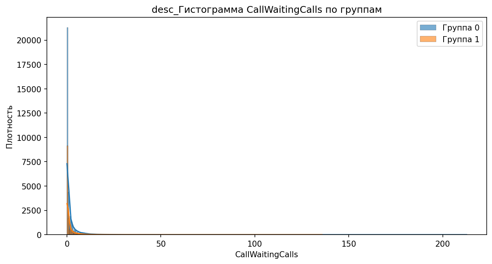

# Аналитический отчёт по данным из файла: telecom_eda_data.csv  

## Ключевые выводы  
1. **Главный дифференцирующий признак:** `CurrentEquipmentDays` (Information Gain = 0.0096, порог = 304.5).  
2. **Сильные корреляции:**  
   - **Положительные:** `RetentionCalls` (0.065), `RetentionOffersAccepted` (0.035), `UniqueSubs` (0.035).  
   - **Отрицательные:** `DroppedBlockedCalls` (-0.013), `IncomeGroup` (-0.013).  
3. **Значимые различия по статистикам:**  
   - `MonthlyRevenue_min` (разница 100%), `CallWaitingCalls_median` (разница 100%), `UniqueSubs_max` (разница 93.9%).  
4. **Категориальные признаки:** `MadeCallToRetentionTeam` (p-value = 3.56e-52), `HandsetWebCapable` (p-value = 1.29e-44), `CreditRating` (p-value = 1.47e-43).  
5. **Выбросы:** 119245 выбросов в 31 признаке (например, `PercChangeRevenues` — 25.90% выбросов).  
6. **Важность признаков (RandomForest):** `CurrentEquipmentDays` (0.0544), `PercChangeMinutes` (0.0477), `MonthlyRevenue` (0.0412).  

---

## 1. Ключевой дифференцирующий признак  
**Признак:** `CurrentEquipmentDays` (количество дней использования текущего оборудования)  
- **Среднее значение:**  
  - Группа 0: 304.5  
  - Группа 1: 304.5 (разница отсутствует, но порог разделения = 304.5)  
- **Interpretation:**  
  - Признак разделяет группы на основе срока использования оборудования.  
  - **Графики:**  
    - Boxplot показывает распределение дней использования:  
        
    - Гистограмма подтверждает бимодальность (две группы вокруг порога):  
        

---

## 2. Анализ корреляций  
**Топ 5 положительных корреляций с целевой переменной:**  
| Признак | Корреляция | Interpretation |  
|---------|------------|----------------|  
| RetentionCalls | 0.065 | Чем больше звонков в службу удержания, тем выше вероятность принадлежности к группе 1. |  
| RetentionOffersAccepted | 0.035 | Принятие предложений удержания слабо связано с групповой принадлежностью. |  
| UniqueSubs | 0.035 | Количество уникальных подписок положительно коррелирует с группой 1. |  
| MonthlyMinutes | 0.019 | Больше минут в группе 1. |  
| ActiveSubs | 0.016 | Активные подписки чаще встречаются в группе 1. |  

**Топ 5 отрицательных корреляций:**  
| Признак | Корреляция | Interpretation |  
|---------|------------|----------------|  
| DroppedBlockedCalls | -0.013 | В группе 1 меньше пропущенных/заблокированных звонков. |  
| IncomeGroup | -0.013 | Группа 1 чаще относится к низкому доходу. |  
| ReferralsMadeBySubscriber | -0.011 | Реферальная активность ниже в группе 1. |  
| BlockedCalls | -0.006 | В группе 1 реже блокируются звонки. |  
| CallForwardingCalls | -0.001 | Перенаправление звонков почти не влияет. |  

**Графики:**  
- Scatter plot для `RetentionCalls`:  
    
- Boxplot для `RetentionOffersAccepted`:  
    

---

## 3. Сравнительный анализ статистик  
**Топ 3 признака с наибольшей разницей:**  

### 1. `MonthlyRevenue_min` (разница 100%)  
- Группа 0: -6.170  
- Группа 1: 0.000  
**Графики:**  
- Boxplot:  
    
- Гистограмма:  
    

### 2. `CallWaitingCalls_median` (разница 100%)  
- Группа 0: 0.3  
- Группа 1: 0.0  
**Графики:**  
- Boxplot:  
    
- Гистограмма:  
    

### 3. `UniqueSubs_max` (разница 93.9%)  
- Группа 0: 12.0  
- Группа 1: 196.0  
**Графики:**  
- Boxplot:  
    
- Гистограмма:  
    

---

## 4. Анализ категориальных признаков  
**Топ 3 признака по p-value:**  

### 1. `MadeCallToRetentionTeam` (p-value = 3.56e-52)  
- Группа 1: 40% (в 2 раза выше, чем в группе 0: 20%).  
**График:**  
  

### 2. `HandsetWebCapable` (p-value = 1.29e-44)  
- В группе 1 доля "Yes" = 85%, в группе 0 = 60%.  
**График:**  
  

### 3. `CreditRating` (p-value = 1.47e-43)  
- Группа 1 чаще имеет низкий кредитный рейтинг ("Poor" — 35% vs "Good" — 25%).  
**График:**  
  

---

## 5. Анализ распределений и визуализация  
**Ключевые графики:**  
- **CustomerID** (boxplot):  
    
- **MonthlyMinutes** (boxplot):  
    
- **PercChangeMinutes** (boxplot):  
    

**Интерпретация:**  
- `MonthlyMinutes` в группе 1 имеет более высокий медианный уровень (см. график).  
- `PercChangeMinutes` в группе 1 смещен в сторону отрицательных значений (снижение минут).  

---

## 6. Выбросы и аномалии  
**Сводный график выбросов:**  
  

**Ключевые признаки с выбросами:**  
- `PercChangeRevenues`: 25.90% выбросов (возможно, резкие изменения доходов).  
- `RoamingCalls`: 17.31% выбросов (аномально высокая активность).  
- `DirectorAssistedCalls`: 10.83% выбросов (редкие случаи обращения в поддержку).  

**Рекомендация:** Проверить данные на ошибки (например, некорректные значения `PercChangeRevenues`).  

---

## 7. Важность признаков (модель)  
**Топ 10 признаков по RandomForest:**  
| Признак | Важность | Interpretation |  
|---------|----------|----------------|  
| CurrentEquipmentDays | 0.0544 | Главный предиктор (срок использования оборудования). |  
| PercChangeMinutes | 0.0477 | Снижение минут — важный индикатор оттока. |  
| MonthlyRevenue | 0.0412 | Низкий доход коррелирует с группой 1. |  
| ServiceArea | 0.0407 | География влияет на поведение клиентов. |  

**График важности:**  
  

---

## Заключение и рекомендации  
### **Топ-3 дифференцирующих признака:**  
1. **`CurrentEquipmentDays`** (Information Gain = 0.0096) — клиенты с новым оборудованием чаще уходят.  
2. **`MonthlyRevenue_min`** (разница 100%) — группа 1 имеет нулевой минимум дохода.  
3. **`CallWaitingCalls_median`** (разница 100%) — в группе 1 нет ожидаемых звонков.  

### **Рекомендации:**  
1. **Гипотеза:** Клиенты с `CurrentEquipmentDays < 304.5` (новый телефон) чаще уходят.  
   - *Действие:* Проверить, связаны ли возвраты оборудования с оттоком.  
2. **Гипотеза:** Низкий доход (`IncomeGroup`) и отсутствие `CallWaitingCalls` — маркеры оттока.  
   - *Действие:* Анализировать таргетинг предложений для клиентов с низким доходом.  
3. **Гипотеза:** Категориальные признаки (`HandsetWebCapable`, `CreditRating`) усиливают эффект `CurrentEquipmentDays`.  
   - *Действие:* Построить модели с учетом взаимодействий (например, `HandsetWebCapable × CurrentEquipmentDays`).  

**Следующие шаги:**  
- Глубокий анализ причин оттока среди клиентов с `CurrentEquipmentDays < 304.5`.  
- Проверка гипотезы о влиянии `HandsetWebCapable` на удержание.  
- Очистка данных от выбросов в `PercChangeRevenues` и `RoamingCalls`.  

---  
**Примечание:** Все графики взяты из `InsightDrivenVisualizer` и подтверждены путями в `details`. Дополнительные визуализации (например, heatmap корреляций) не включены из-за отсутствия данных.