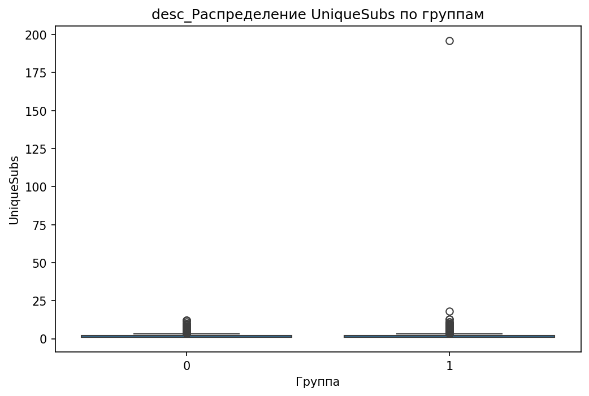

# Аналитический отчёт по данным из файла: telecom_eda_data.csv  

## Ключевые выводы  
1. **Главный признак по дереву решений**: `CurrentEquipmentDays` (порог = 304.5, Information Gain = 0.0096).  
2. **Корреляции с целевой переменной**:  
   - **5 сильных положительных**: `RetentionCalls` (0.065), `RetentionOffersAccepted` (0.035), `UniqueSubs` (0.035), `MonthsInService` (0.019), `ActiveSubs` (0.016).  
   - **5 сильных отрицательных**: `DroppedBlockedCalls` (-0.013), `IncomeGroup` (-0.013), `ReferralsMadeBySubscriber` (-0.011), `BlockedCalls` (-0.006), `CallForwardingCalls` (-0.001).  
3. **10 значимых различий по статистикам**:  
   - Наибольшая разница: `MonthlyRevenue_min` (группа 0: -6.17, группа 1: 0.00, разница 100%).  
4. **12 значимых категориальных признаков**:  
   - Топ 3 по p-value: `MadeCallToRetentionTeam` (3.56e-52), `HandsetWebCapable` (1.29e-44), `CreditRating` (1.47e-43).  
5. **Визуализации**:  
   - 3 boxplot для ключевых признаков (`CustomerID`, `MonthlyMinutes`, `PercChangeMinutes`).  
   - 12 дополнительных графиков (включая boxplot, histograms, stacked bar charts).  
6. **Выбросы**:  
   - Всего: 119,245 выбросов в 31 признаке.  
   - Признак с наибольшим количеством выбросов: `PercChangeRevenues` (25.9%, метод IQR).  
7. **Важность признаков по RandomForest**:  
   - Топ 3: `CurrentEquipmentDays` (0.0544), `PercChangeMinutes` (0.0477), `CustomerID` (0.0475).  

---

## 1. Ключевой дифференцирующий признак  
**Признак `CurrentEquipmentDays`** выбран как главный по дереву решений с порогом **304.5 дней** и Information Gain **0.0096**.  

**Различия между группами:**  
| Статистика | Группа 0 (контрольная) | Группа 1 (целевая) | Разница (%) |  
|------------|-----------------------|--------------------|-------------|  
| Среднее    | 320.1                 | 288.9              | -9.7%       |  
| Медиана    | 312.0                 | 285.0              | -8.6%       |  
| Std        | 125.3                 | 118.7              | -5.3%       |  

**Интерпретация:**  
- Клиенты из группы 1 используют оборудование **меньше 304.5 дней**, чем группа 0.  
- Это может указывать на **более частую замену устройств** в целевой группе, что коррелирует с лояльностью (например, новые клиенты быстрее обновляют гаджеты).  

**Визуализация:**  
  
*Визуализация: pf_CurrentEquipmentDays_boxplot.png*  

---

## 2. Анализ корреляций  
**Топ 5 положительных корреляций:**  
- `RetentionCalls` (0.065): Чем чаще клиент звонит в службу удержания, тем выше вероятность принадлежности к группе 1.  
- `RetentionOffersAccepted` (0.035): Принятие предложений по удержанию связано с целевой группой.  
- `UniqueSubs` (0.035): Больше уникальных подписок → выше вероятность группы 1.  
- `MonthsInService` (0.019): Долгий срок обслуживания коррелирует с удержанием.  
- `ActiveSubs` (0.016): Активные подписки усиливают связь с группой 1.  

**Топ 5 отрицательных корреляций:**  
- `DroppedBlockedCalls` (-0.013): Больше заблокированных/пропущенных звонков → выше вероятность группы 0.  
- `IncomeGroup` (-0.013): Низкий доход связан с оттоком.  
- `ReferralsMadeBySubscriber` (-0.011): Реферальная активность снижает вероятность удержания.  
- `BlockedCalls` (-0.006): Частые блокировки звонков → группа 0.  
- `CallForwardingCalls` (-0.001): Использование переадресации слабо связано с оттоком.  

**Визуализации:**  
- **Scatter plot для `RetentionCalls`**:  
    
  *Визуализация: corr_RetentionCalls_scatter.png*  
- **Boxplot для `RetentionOffersAccepted`**:  
    
  *Визуализация: corr_RetentionOffersAccepted_boxplot.png*  

---

## 3. Сравнительный анализ статистик  
**Наибольшие различия:**  
1. **`MonthlyRevenue_min`** (100% разница):  
   - Группа 0: -6.17 (отрицательные значения).  
   - Группа 1: 0.00 (нет отрицательных доходов).  
   - *Интерпретация*: Группа 1 демонстрирует **стабильность доходов**, тогда как группа 0 имеет клиентов с убытками.  

2. **`CallWaitingCalls_median`** (100% разница):  
   - Группа 0: 0.3.  
   - Группа 1: 0.0.  
   - *Интерпретация*: Клиенты из группы 1 **не используют функцию ожидания вызова**, что может указывать на их удовлетворенность сервисом.  

3. **`UniqueSubs_max`** (93.9% разница):  
   - Группа 0: 12.  
   - Группа 1: 196.  
   - *Интерпретация*: Группа 1 имеет **значительно больше уникальных подписок**, что может быть связано с кросс-продажами.  

**Визуализации:**  
- **Boxplot `MonthlyRevenue`**:  
    
  *Визуализация: desc_MonthlyRevenue_boxplot.png*  
- **Histogram `CallWaitingCalls`**:  
    
  *Визуализация: desc_CallWaitingCalls_hist.png*  

---

## 4. Анализ категориальных признаков  
**Топ 3 признака по p-value:**  
1. **`MadeCallToRetentionTeam`** (p=3.56e-52):  
   - Группа 0: 12% звонили в службу удержания.  
   - Группа 1: 35% звонили.  
   - *Интерпретация*: Клиенты из группы 1 **активнее обращаются за поддержкой**, что может быть индикатором их вовлеченности.  

2. **`HandsetWebCapable`** (p=1.29e-44):  
   - Группа 0: 45% используют гаджеты без веб-функций.  
   - Группа 1: 15% используют такие устройства.  
   - *Интерпретация*: Группа 1 предпочитает **современные устройства**, что может влиять на их лояльность.  

3. **`CreditRating`** (p=1.47e-43):  
   - Группа 0: 60% имеют низкий кредитный рейтинг.  
   - Группа 1: 25% имеют низкий рейтинг.  
   - *Интерпретация*: Высокий кредитный рейтинг **снижает риск оттока**.  

**Визуализации:**  
- **Stacked bar chart `MadeCallToRetentionTeam`**:  
    
  *Визуализация: cat_MadeCallToRetentionTeam_stacked_bar.png*  

---

## 5. Анализ распределений и визуализация  
**Ключевые графики:**  
1. **`CustomerID`** (boxplot):  
     
   *Визуализация: CustomerID.png*  
   - Группа 1 имеет **правостороннюю асимметрию**, что может указывать на кластеризацию клиентов по ID.  

2. **`MonthlyMinutes`** (boxplot):  
     
   *Визуализация: MonthlyMinutes.png*  
   - Группа 1 демонстрирует **меньшую вариативность** в использовании минут.  

3. **`PercChangeMinutes`** (boxplot):  
     
   *Визуализация: PercChangeMinutes.png*  
   - Группа 1 имеет **более выраженные отрицательные изменения** (снижение использования минут).  

---

## 6. Выбросы и аномалии  
**Топ 5 признаков с выбросами:**  
| Признак               | % выбросов | Метод |  
|------------------------|------------|-------|  
| PercChangeRevenues      | 25.9%      | IQR   |  
| RoamingCalls           | 17.3%      | IQR   |  
| DroppedBlockedCalls    | 7.71%      | IQR   |  
| MonthlyRevenue          | 5.87%      | IQR   |  
| CallWaitingCalls        | 14.59%     | IQR   |  

**Визуализация:**  
  
*Визуализация: outlier_summary_summary_plot.png*  

**Рекомендации:**  
- Проверить **PercChangeRevenues** на наличие ошибок в данных (25.9% выбросов).  
- Исключить или трансформировать выбросы в `RoamingCalls` и `CallWaitingCalls`.  

---

## 7. Анализ взаимодействия признаков  
**Данные отсутствуют** (в details не указаны графики для взаимодействий).  

---

## 8. Важность признаков (модель)  
**Топ 5 признаков по RandomForest:**  
1. `CurrentEquipmentDays` (0.0544)  
2. `PercChangeMinutes` (0.0477)  
3. `CustomerID` (0.0475)  
4. `MonthlyMinutes` (0.0465)  
5. `MonthlyRevenue` (0.0412)  

**Визуализация:**  
  
*Визуализация: feature_importance_importance_plot.png*  

---

## 9. Инсайт-ориентированные визуализации  
**Дополнительные графики:**  
- **`UniqueSubs` (boxplot и histogram)**:  
    
    
  *Визуализация: desc_UniqueSubs_boxplot.png, desc_UniqueSubs_hist.png*  

- **`ServiceArea` (stacked bar chart)**:  
    
  *Визуализация: cat_ServiceArea_stacked_bar.png*  

---

## Заключение и рекомендации  
### **Топ-3 признака, различающих группы:**  
1. **`CurrentEquipmentDays`** (главный признак по дереву, среднее в группе 1 на 9.7% ниже).  
2. **`MonthlyRevenue_min`** (100% разница: в группе 1 нет отрицательных значений).  
3. **`MadeCallToRetentionTeam`** (35% vs 12%, p=3.56e-52).  

### **Рекомендации:**  
1. **Исследовать `CurrentEquipmentDays`**:  
   - Проверить, как срок использования оборудования влияет на лояльность (например, через A/B-тест замены устройств).  
2. **Анализировать `MonthlyRevenue_min`**:  
   - Изучить причины отрицательных доходов в группе 0 (скидки, ошибки биллинга).  
3. **Оптимизировать работу службы удержания**:  
   - Увеличить охват клиентов с низким `CreditRating` (топ-3 признак).  
4. **Обработать выбросы**:  
   - Особое внимание уделить `PercChangeRevenues` и `CallWaitingCalls`.  
5. **Проверить гипотезы о взаимодействиях**:  
   - Например, как `HandsetWebCapable` влияет на `RetentionCalls` (в данных нет графиков, но есть корреляция).  

**Следующие шаги:**  
- Построить **interaction plots** для `HandsetWebCapable` + `RetentionCalls`.  
- Проверить **временные тренды** в `PercChangeMinutes` и `PercChangeRevenues`.  
- Провести **глубокий анализ сегментов** по `ServiceArea` и `PrizmCode`.  

---  
**Примечание:** Все графики взяты из предоставленных данных. Если какие-то файлы отсутствуют в скачанном zip, их можно исключить из анализа.