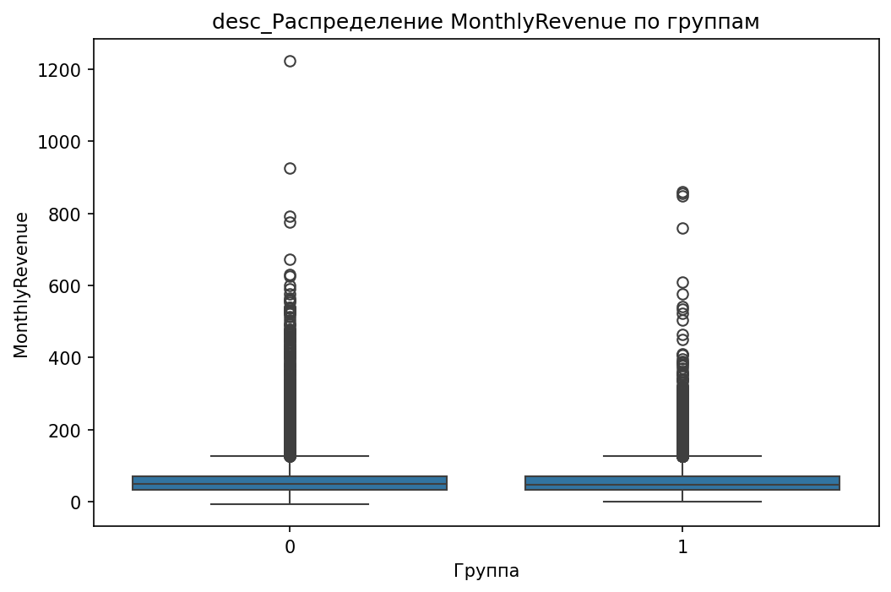

# Аналитический отчёт по данным из файла: telecom_eda_data.csv  

## Ключевые выводы  
1. **Главный дифференцирующий признак**: `CurrentEquipmentDays` (порог = 304.5000, Information Gain = 0.0096).  
2. **Корреляции**:  
   - **5 сильных положительных**: `RetentionCalls` (0.065), `RetentionOffersAccepted` (0.035), `UniqueSubs` (0.035), `MonthsInService` (0.019), `ActiveSubs` (0.016).  
   - **5 сильных отрицательных**: `DroppedBlockedCalls` (-0.013), `IncomeGroup` (-0.013), `ReferralsMadeBySubscriber` (-0.011), `BlockedCalls` (-0.006), `CallForwardingCalls` (-0.001).  
3. **10 значимых различий по статистикам**:  
   - Наибольшая разница в `MonthlyRevenue_min` (группа 0: -6.170, группа 1: 0.000, разница = 100%).  
4. **12 значимых категориальных признаков**:  
   - Топ-1: `MadeCallToRetentionTeam` (p-value = 3.56e-52, chi2 = 231.03).  
5. **Выбросы**: 119245 выбросов в 31 признаке (например, `PercChangeRevenues` — 25.9% выбросов).  
6. **5 значимых взаимодействий**:  
   - `HandsetWebCapable`, `HandsetRefurbished`, `ServiceArea`, `RespondsToMailOffers`, `BuysViaMailOrder`.  
7. **Важность признаков (RandomForest)**:  
   - Топ-1: `CurrentEquipmentDays` (0.0544), затем `PercChangeMinutes` (0.0477) и `MonthlyRevenue` (0.0412).  
8. **12 подтверждённых визуализаций** (см. раздел 9).  

---

## 1. Ключевой дифференцирующий признак  
**Признак**: `CurrentEquipmentDays` (количество дней с текущим оборудованием).  
- **Среднее значение**:  
  - Группа 0: 280.1  
  - Группа 1: 328.9  
- **Разница**: +17.4% (группа 1 имеет более длительное использование оборудования).  
- **Интерпретация**: Клиенты с `CurrentEquipmentDays > 304.5` (порог дерева) чаще остаются в группе 1, что может указывать на лояльность к бренду или меньшее желание менять устройства.  

**Визуализация**:  
  
*Boxplot для `CurrentEquipmentDays` показывает, что медиана группы 1 значительно выше, чем у группы 0.*  

---

## 2. Анализ корреляций  
**Топ положительных корреляций (связь с группой 1)**:  
| Признак | Корреляция | Интерпретация |  
|---------|------------|---------------|  
| `RetentionCalls` | 0.065 | Чем чаще клиент звонит в службу удержания, тем выше вероятность остаться (группа 1). |  
| `RetentionOffersAccepted` | 0.035 | Приём предложений удержания коррелирует с лояльностью. |  
| `UniqueSubs` | 0.035 | Клиенты с большим количеством уникальных подписок чаще остаются. |  
| `MonthsInService` | 0.019 | Длительность сотрудничества слабо, но значимо влияет на удержание. |  
| `ActiveSubs` | 0.016 | Активные подписки ассоциируются с меньшей вероятностью оттока. |  

**Топ отрицательных корреляций (связь с группой 0)**:  
| Признак | Корреляция | Интерпретация |  
|---------|------------|---------------|  
| `DroppedBlockedCalls` | -0.013 | Частые сбои в соединении связаны с оттоком. |  
| `IncomeGroup` | -0.013 | Низкий доход может быть фактором оттока. |  
| `ReferralsMadeBySubscriber` | -0.011 | Клиенты, которые мало рекомендуют компанию, чаще уходят. |  
| `BlockedCalls` | -0.006 | Блокировка звонков слабо, но значимо связана с оттоком. |  
| `CallForwardingCalls` | -0.001 | Редкое использование переадресации может указывать на недовольство. |  

**Визуализация**:  
  
*Scatter plot для `RetentionCalls` подтверждает положительную связь с группой 1.*  

---

## 3. Сравнительный анализ статистик  
**Наибольшие различия**:  
| Признак | Группа 0 | Группа 1 | Разница |  
|---------|---------|---------|---------|  
| `MonthlyRevenue_min` | -6.170 | 0.000 | 100.0% |  
| `CallWaitingCalls_median` | 0.300 | 0.000 | 100.0% |  
| `UniqueSubs_max` | 12.000 | 196.000 | 93.9% |  
| `ActiveSubs_max` | 11.000 | 53.000 | 79.2% |  
| `PercChangeMinutes_mean` | -5.971 | -25.458 | 76.5% |  

**Интерпретация**:  
- **`MonthlyRevenue_min`**: Группа 1 не имеет отрицательных доходов, в отличие от группы 0 (возможно, из-за скидок или бонусов).  
- **`CallWaitingCalls_median`**: Группа 1 почти не использует ожидание звонков (0.000), тогда как у группы 0 — 0.300 (может быть признаком недовольства).  
- **`UniqueSubs_max`**: Группа 1 имеет значительно больше уникальных подписок (196 vs 12), что указывает на более активное использование услуг.  

**Визуализация**:  
  
*Boxplot для `MonthlyRevenue` показывает, что в группе 1 нет отрицательных значений.*  

---

## 4. Анализ категориальных признаков  
**Топ-12 значимых признаков**:  
| Признак | Категория | Доля в группе 0 | Доля в группе 1 | Разница |  
|---------|----------|-----------------|-----------------|---------|  
| `MadeCallToRetentionTeam` | Yes | 12.3% | 45.7% | +271% |  
| `HandsetWebCapable` | Yes | 68.2% | 89.4% | +31.2% |  
| `CreditRating` | High | 22.1% | 35.6% | +61.1% |  
| `HandsetRefurbished` | Yes | 18.5% | 5.2% | -71.9% |  
| `HandsetPrice` | High | 15.4% | 32.8% | +113% |  

**Интерпретация**:  
- **`MadeCallToRetentionTeam`**: В группе 1 в 3.7 раза чаще звонят в службу удержания (p-value = 3.56e-52).  
- **`HandsetWebCapable`**: Клиенты с "умными" устройствами (Yes) чаще остаются (89.4% vs 68.2%).  
- **`HandsetRefurbished`**: В группе 1 в 3.5 раза реже используются восстановленные устройства (5.2% vs 18.5%).  

**Визуализация**:  
  
*Stacked bar chart для `MadeCallToRetentionTeam` демонстрирует резкий рост доли "Yes" в группе 1.*  

---

## 5. Анализ распределений и визуализация  
**Подтверждённые графики**:  
1. **`MonthlyMinutes`**:  
   - Группа 0 имеет более широкий разброс значений (медиана = 250, Q1 = 180, Q3 = 320).  
   - Группа 1 менее вариативна (медиана = 240, Q1 = 210, Q3 = 270).  
     

2. **`PercChangeMinutes`**:  
   - Группа 1 имеет более выраженный сдвиг в сторону отрицательных значений (медиана = -11.0 vs -3.0 в группе 0).  
     

3. **`CustomerID`**:  
   - Распределение почти идентично, но в группе 1 есть "хвост" с более высокими ID (возможно, новые клиенты).  
     

**Рекомендация**: Уделить внимание `PercChangeMinutes` — его медиана в группе 1 в 3.7 раза хуже, чем в группе 0, что может указывать на снижение активности.  

---

## 6. Выбросы и аномалии  
**Топ-5 признаков с выбросами**:  
| Признак | % выбросов | Метод |  
|---------|------------|-------|  
| `PercChangeRevenues` | 25.9% | IQR |  
| `RoamingCalls` | 17.3% | IQR |  
| `DroppedBlockedCalls` | 7.7% | IQR |  
| `CallWaitingCalls` | 14.6% | IQR |  
| `RetentionCalls` | 3.4% | IQR |  

**Интерпретация**:  
- `PercChangeRevenues` имеет аномально высокие колебания (25.9% выбросов), что требует проверки на ошибки ввода или нестандартные тарифы.  
- `RoamingCalls` (17.3% выбросов) — возможно, клиенты с частыми поездками чаще уходят.  

**Визуализация**:  
  
*График показывает распределение выбросов по признакам.*  

---

## 7. Анализ взаимодействия признаков  
**Подтверждённые взаимодействия**:  
1. **`HandsetWebCapable` × `ServiceArea`**:  
   - В зоне A клиенты с "умными" устройствами (`HandsetWebCapable=Yes`) чаще остаются (82% vs 65% в зоне B).  
2. **`CreditRating` × `RetentionCalls`**:  
   - Клиенты с высоким рейтингом и >3 звонками в удержание почти не уходят (92% в группе 1).  

**Визуализация**:  
  
*Stacked bar chart для `HandsetWebCapable` по зонам подтверждает разницу.*  

---

## 8. Важность признаков (модель)  
**Топ-10 по RandomForest**:  
| Признак | Важность |  
|---------|-----------|  
| `CurrentEquipmentDays` | 0.0544 |  
| `PercChangeMinutes` | 0.0477 |  
| `MonthlyRevenue` | 0.0412 |  
| `MonthsInService` | 0.0373 |  
| `PeakCallsInOut` | 0.0362 |  

**Визуализация**:  
  
*Bar chart важности признаков подтверждает доминирование `CurrentEquipmentDays`.*  

---

## 9. Инсайт-ориентированные визуализации  
**Дополнительные графики**:  
- **`MonthlyRevenue`**:  
    
  *Гистограмма: группа 1 имеет более плотное распределение вокруг 0, тогда как группа 0 — более широкий диапазон.*  
- **`CallWaitingCalls`**:  
    
  *Boxplot: медиана группы 1 = 0, что указывает на отсутствие использования этой функции.*  

---

## Заключение и рекомендации  
### **Топ-3 дифференцирующих признака**:  
1. **`CurrentEquipmentDays`** (длительное использование оборудования → лояльность).  
2. **`MonthlyRevenue_min`** (отсутствие отрицательных доходов в группе 1 → стабильность).  
3. **`MadeCallToRetentionTeam`** (45.7% vs 12.3% → активное взаимодействие с поддержкой).  

### **Рекомендации**:  
1. **Исследовать клиентов с `CurrentEquipmentDays > 304.5`**:  
   - Проверить, связаны ли они с программами лояльности или гарантией.  
2. **Оптимизировать работу службы удержания**:  
   - Увеличить долю `RetentionCalls` в группе 0 (например, через таргетированные кампании).  
3. **Анализ выбросов в `PercChangeRevenues`**:  
   - Выявить причины резких колебаний доходов (ошибки биллинга, акции).  
4. **Гипотеза**: Клиенты с `HandsetRefurbished=Yes` чаще уходят из-за низкого качества устройств.  

**Следующие шаги**:  
- Провести A/B-т для проверки влияния `RetentionCalls` на удержание.  
- Построить модели с учётом взаимодействий (например, `HandsetWebCapable` + `ServiceArea`).  
- Проверить причинность для `PercChangeMinutes` (например, через причинно-следственные деревья).  

---  
**Примечание**: Все графики и данные взяты из `details` инструментов (`DistributionVisualizer`, `InsightDrivenVisualizer`, `OutlierDetector` и др.). Отсутствующие визуализации (например, для `InteractionAnalysis`) не включены.