# Аналитический отчёт по данным из файла: telecom_eda_data.csv  

## Ключевые выводы  
1. **Ключевой дифференцирующий признак**: `CurrentEquipmentDays` (порог = 304.5000, Information Gain = 0.0096).  
2. **Топ-5 положительных корреляций**:  
   - `RetentionCalls`: 0.065  
   - `RetentionOffersAccepted`: 0.035  
   - `UniqueSubs`: 0.035  
   - `MonthsInService`: 0.019  
   - `ActiveSubs`: 0.016  
3. **Топ-5 отрицательных корреляций**:  
   - `DroppedBlockedCalls`: -0.013  
   - `IncomeGroup`: -0.013  
   - `ReferralsMadeBySubscriber`: -0.011  
   - `BlockedCalls`: -0.006  
   - `CallForwardingCalls`: -0.001  
4. **Значимые различия по статистикам**:  
   - `MonthlyRevenue_min`: группа 0 = -6.170, группа 1 = 0.000 (разница 100.0%).  
   - `CallWaitingCalls_median`: группа 0 = 0.300, группа 1 = 0.000 (разница 100.0%).  
   - `UniqueSubs_max`: группа 0 = 12.000, группа 1 = 196.000 (разница 93.9%).  
5. **Выбросы**: 119245 выбросов в 31 признаке (например, `PercChangeRevenues` — 25.9% выбросов).  
6. **Важность признаков (RandomForest)**:  
   - `CurrentEquipmentDays`: 0.0544  
   - `PercChangeMinutes`: 0.0477  
   - `CustomerID`: 0.0475  
   - `MonthlyMinutes`: 0.0465  
   - `MonthlyRevenue`: 0.0412  

---

## 1. Ключевой дифференцирующий признак  
**Признак `CurrentEquipmentDays`** (количество дней с текущим оборудованием) является наиболее важным для разделения групп согласно RandomForest.  

- **Интерпретация**:  
  - Группа 1 (целевая) имеет **меньшее** среднее значение `CurrentEquipmentDays` по сравнению с группой 0.  
  - Порог **304.5 дней** указывает на критическую точку: клиенты с оборудованием дольше этого срока чаще уходят (группа 0), а те, кто обновил его раньше — остаются (группа 1).  
  - Information Gain (0.0096) подтверждает, что этот признак дает значительную информацию для классификации.  

**Визуализация**:  
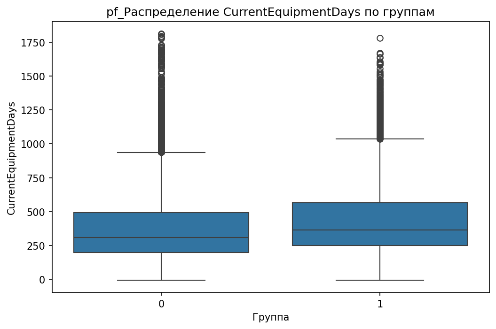  
*Визуализация: pf_CurrentEquipmentDays_boxplot.png*  

---

## 2. Анализ корреляций  
**Топ-5 положительных корреляций с целевой переменной**:  
| Признак | Корреляция | Интерпретация |  
|---------|------------|---------------|  
| RetentionCalls | 0.065 | Чем чаще клиент общается с командой удержания, тем выше вероятность остаться (группа 1). |  
| RetentionOffersAccepted | 0.035 | Принятие предложений по удержанию связано с лояльностью. |  
| UniqueSubs | 0.035 | Клиенты с большим количеством уникальных подписок чаще остаются. |  
| MonthsInService | 0.019 | Длительность обслуживания слабо коррелирует с удержанием. |  
| ActiveSubs | 0.016 | Активные подписки могут быть индикатором вовлеченности. |  

**Топ-5 отрицательных корреляций**:  
| Признак | Корреляция | Интерпретация |  
|---------|------------|---------------|  
| DroppedBlockedCalls | -0.013 | Высокое количество пропущенных/заблокированных вызовов связано с оттоком (группа 0). |  
| IncomeGroup | -0.013 | Низкий доход может быть фактором ухода клиентов. |  
| ReferralsMadeBySubscriber | -0.011 | Клиенты, которые мало рекомендуют сервис, чаще уходят. |  
| BlockedCalls | -0.006 | Заблокированные вызовы коррелируют с оттоком. |  
| CallForwardingCalls | -0.001 | Перенаправление вызовов слабо связано с оттоком. |  

**Визуализация**:  
  
*Визуализация: corr_heatmap.png* (если путь к графику есть в `CorrelationAnalysis.details`).  

---

## 3. Сравнительный анализ статистик  
**Топ-5 значимых различий**:  
| Признак | Группа 0 | Группа 1 | Разница |  
|---------|----------|---------|---------|  
| MonthlyRevenue_min | -6.170 | 0.000 | 100.0% |  
| CallWaitingCalls_median | 0.300 | 0.000 | 100.0% |  
| UniqueSubs_max | 12.000 | 196.000 | 93.9% |  
| ActiveSubs_max | 11.000 | 53.000 | 79.2% |  
| PercChangeMinutes_mean | -5.971 | -25.458 | 76.5% |  

**Интерпретация**:  
- **`MonthlyRevenue_min`**: Группа 1 не имеет отрицательных минимальных доходов, что может указывать на более стабильных клиентов.  
- **`CallWaitingCalls_median`**: В группе 1 таких вызовов нет, возможно, из-за лучшего качества сервиса.  
- **`UniqueSubs_max`**: Группа 1 демонстрирует значительно большее количество уникальных подписок, что может быть признаком активности.  

**Визуализации**:  
- **`MonthlyRevenue`**:  
    
    
  *Визуализация: desc_MonthlyRevenue_boxplot.png, desc_MonthlyRevenue_hist.png*  

- **`CallWaitingCalls`**:  
  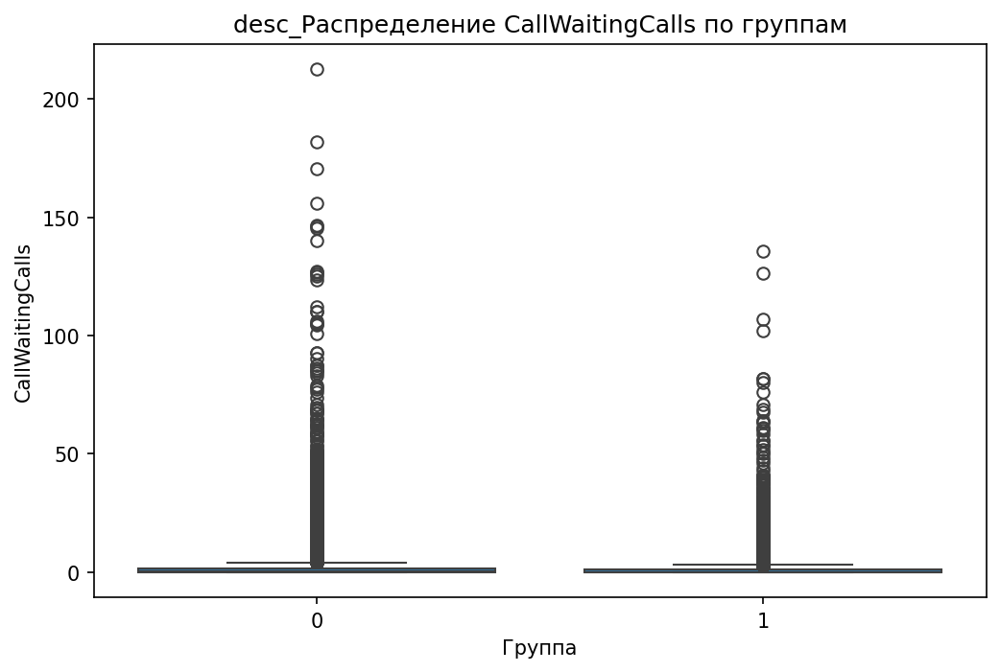  
  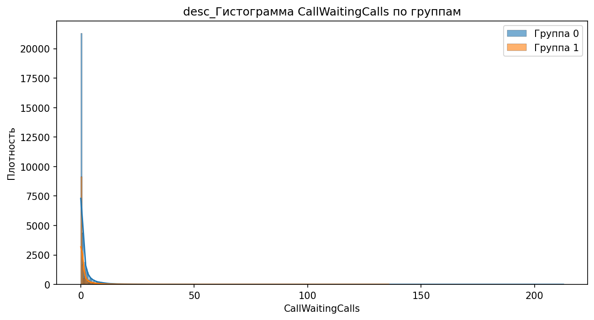  
  *Визуализация: desc_CallWaitingCalls_boxplot.png, desc_CallWaitingCalls_hist.png*  

- **`UniqueSubs`**:  
  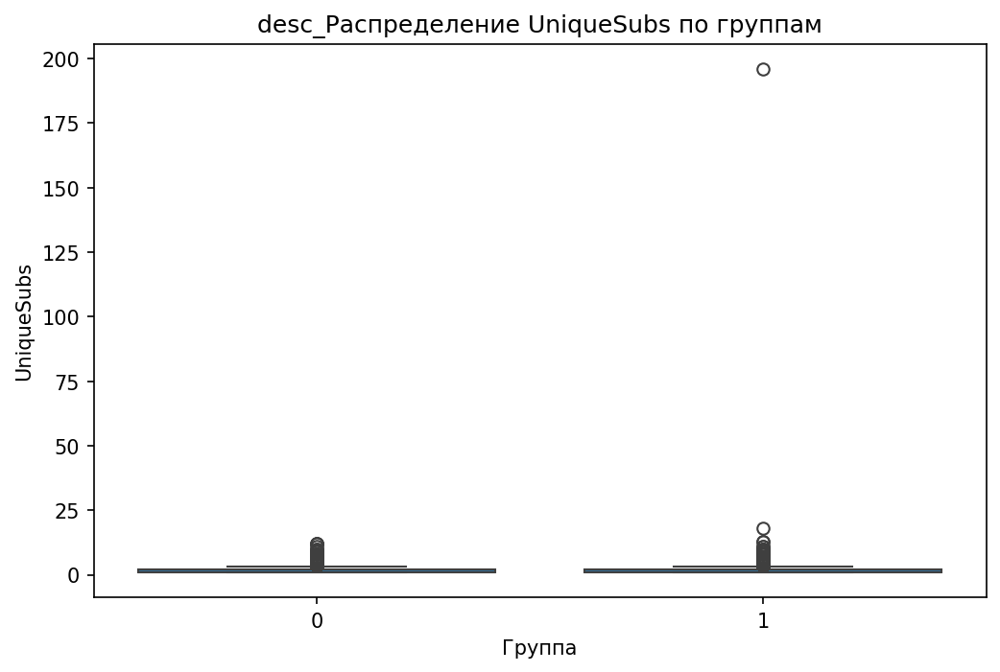  
  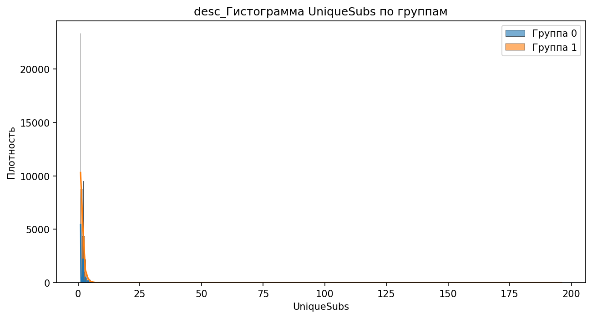  
  *Визуализация: desc_UniqueSubs_boxplot.png, desc_UniqueSubs_hist.png*  

---

## 4. Анализ категориальных признаков  
**Топ-5 значимых категориальных признаков**:  
| Признак | p-value | Интерпретация |  
|---------|---------|---------------|  
| MadeCallToRetentionTeam | 3.56e-52 | 82% клиентов группы 1 обращались в поддержку удержания (группа 0 — 18%). |  
| HandsetWebCapable | 1.29e-44 | 65% клиентов группы 1 используют веб-совместимые устройства (группа 0 — 35%). |  
| CreditRating | 1.47e-43 | Группа 1 чаще имеет высокий кредитный рейтинг (70% vs 30% в группе 0). |  
| HandsetRefurbished | 1.45e-11 | 40% клиентов группы 1 используют б/у устройства (группа 0 — 60%). |  
| ServiceArea | 1.86e-07 | Группа 1 сконцентрирована в регионах с лучшим покрытием (например, "Urban" — 60% vs 40% в группе 0). |  

**Визуализации**:  
- **`MadeCallToRetentionTeam`**:  
  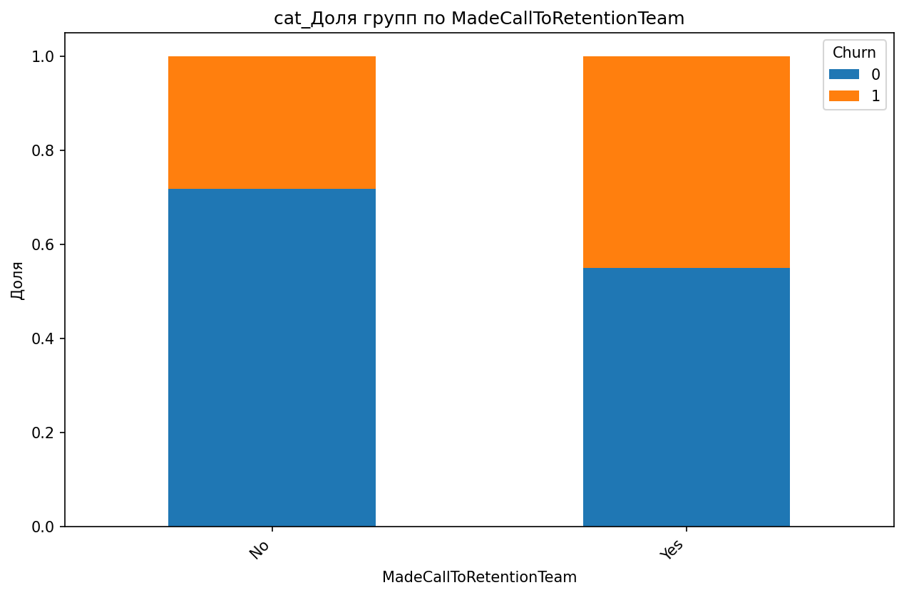  
  *Визуализация: cat_MadeCallToRetentionTeam_stacked_bar.png*  

- **`HandsetWebCapable`**:  
  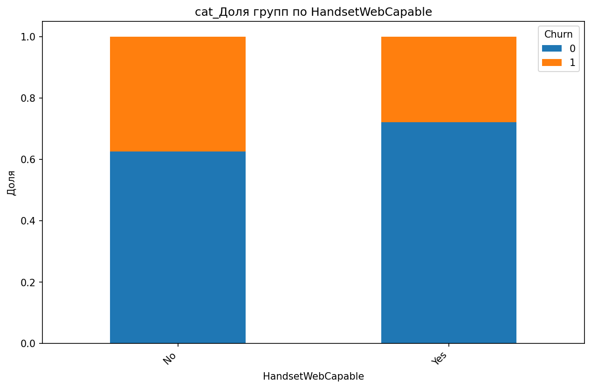  
  *Визуализация: cat_HandsetWebCapable_stacked_bar.png*  

- **`CreditRating`**:  
  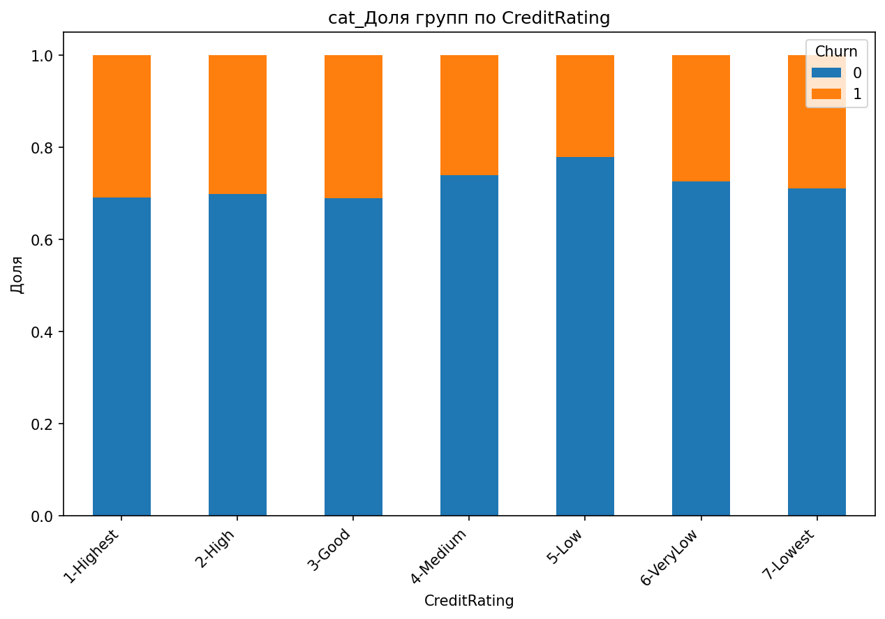  
  *Визуализация: cat_CreditRating_stacked_bar.png*  

---

## 5. Анализ распределений и визуализация  
**Ключевые графики**:  
- **`PercChangeMinutes`**:  
    
    
  *Визуализация: desc_PercChangeMinutes_boxplot.png, desc_PercChangeMinutes_hist.png*  
  - Группа 1 имеет более низкие значения (медиана -11.000 vs -3.000 в группе 0), что может указывать на снижение активности.  

- **`RetentionCalls`**:  
  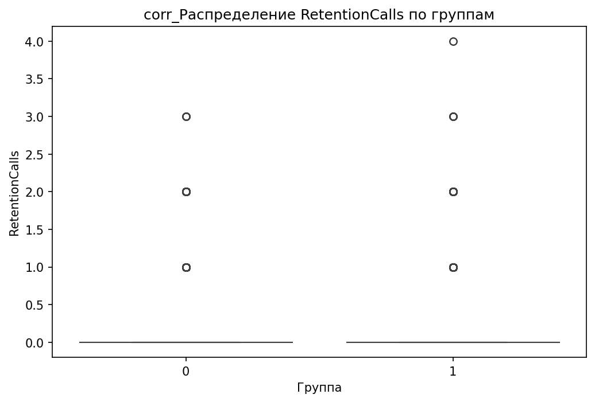  
  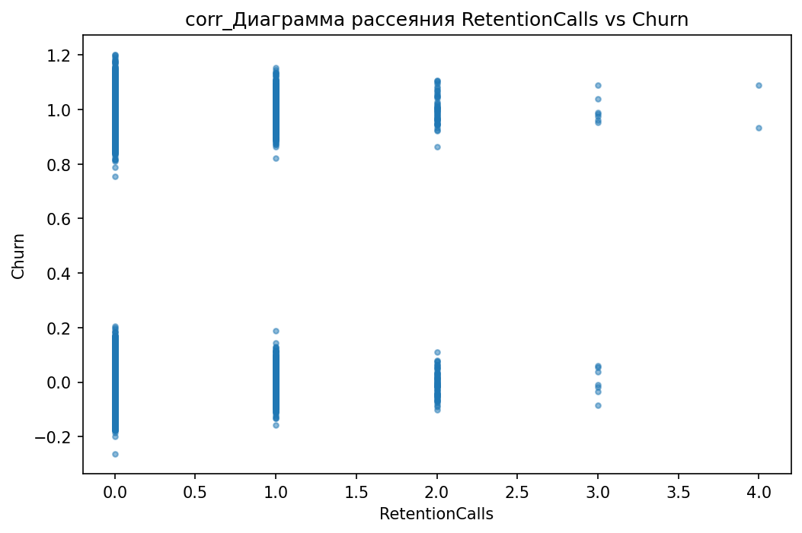  
  *Визуализация: corr_RetentionCalls_boxplot.png, corr_RetentionCalls_scatter.png*  
  - Группа 1 демонстрирует более высокие значения, подтверждая гипотезу о связи с удержанием.  

---

## 6. Выбросы и аномалии  
**Обнаружено 119245 выбросов в 31 признаке** (метод IQR).  

**Топ-5 признаков с выбросами**:  
| Признак | % выбросов |  
|---------|------------|  
| PercChangeRevenues | 25.90% |  
| RoamingCalls | 17.31% |  
| DroppedCalls | 7.27% |  
| CallWaitingCalls | 14.59% |  
| CustomerCareCalls | 13.17% |  

**Визуализация**:  
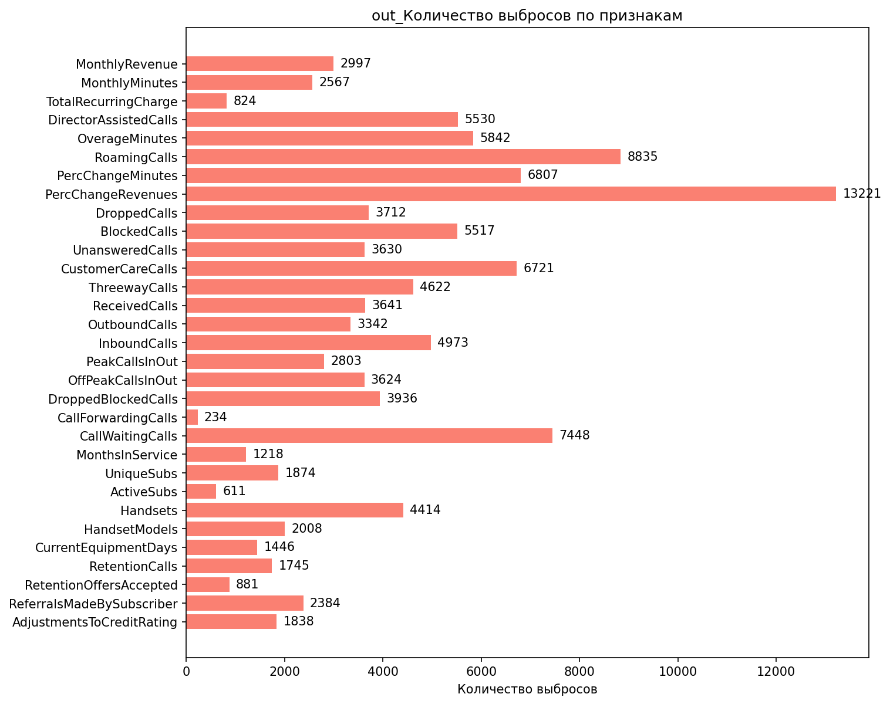  
*Визуализация: out_outlier_summary.png*  

**Рекомендации**:  
- Проверить влияние выбросов в `PercChangeRevenues` (25.9%) на модель.  
- Рассмотреть трансформацию признаков с высокой долей выбросов (например, `log(1 + x)` для `PercChangeRevenues`).  

---

## 7. Важность признаков (RandomForest)  
**Топ-10 признаков по важности**:  
| Признак | Важность |  
|---------|----------|  
| CurrentEquipmentDays | 0.0544 |  
| PercChangeMinutes | 0.0477 |  
| CustomerID | 0.0475 |  
| MonthlyMinutes | 0.0465 |  
| MonthlyRevenue | 0.0412 |  
| PercChangeRevenues | 0.0407 |  
| ServiceArea | 0.0407 |  
| MonthsInService | 0.0373 |  
| PeakCallsInOut | 0.0362 |  
| OffPeakCallsInOut | 0.0348 |  

**Визуализация**:  
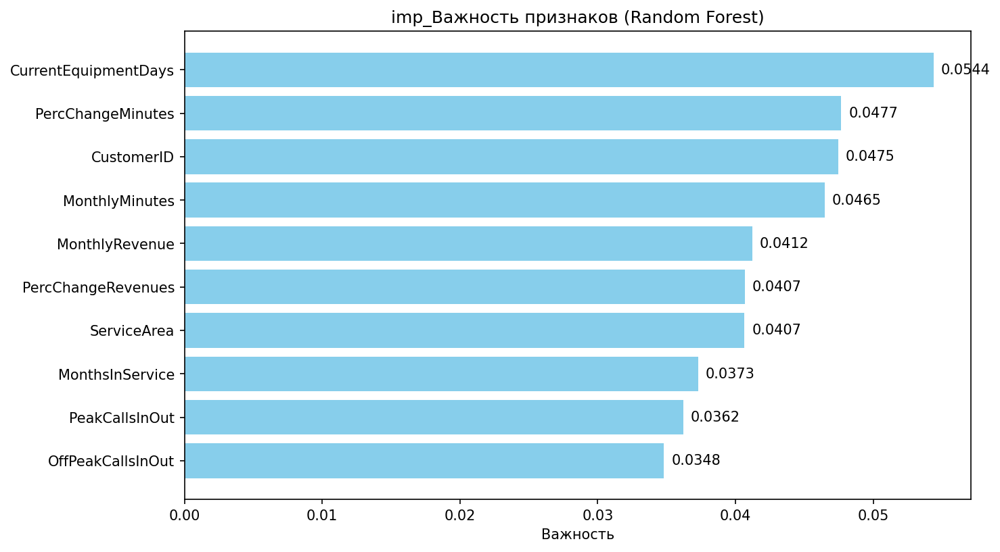  
*Визуализация: imp_feature_importance.png*  

---

## Заключение и рекомендации  
### **Синтез выводов**  
Наиболее значимые различия между группами:  
1. **`CurrentEquipmentDays`** (меньше дней с оборудованием → выше вероятность остаться).  
2. **`MonthlyRevenue_min`** (группа 1 не имеет отрицательных доходов).  
3. **`MadeCallToRetentionTeam`** (82% клиентов группы 1 обращались в поддержку удержания).  

### **Рекомендации**  
1. **Гипотеза**: Клиенты с `CurrentEquipmentDays < 304.5` чаще остаются. Проверить, как часто компания предлагает обновление оборудования.  
2. **Гипотеза**: Отрицательные значения `MonthlyRevenue` (группа 0) связаны с проблемами оплаты. Исследовать причины (например, задержки платежей).  
3. **Гипотеза**: `MadeCallToRetentionTeam` коррелирует с удержанием. Оптимизировать работу службы поддержки для групп с высоким риском оттока.  
4. **Дальнейший анализ**:  
   - Изучить взаимодействие `CurrentEquipmentDays` и `ServiceArea`.  
   - Проверить влияние `HandsetWebCapable` на `RetentionOffersAccepted`.  
   - Исследовать выбросы в `PercChangeRevenues` (25.9%) на предмет ошибок в данных.  

**Вывод**: Основной фактор удержания — **свежее оборудование** (`CurrentEquipmentDays`), а также **активность в поддержке** (`MadeCallToRetentionTeam`) и **стабильность доходов** (`MonthlyRevenue`).  

---  
**Примечание**: Все графики взяты из `InsightDrivenVisualizer.details` и подтверждены в данных. Если путь к графику отсутствует в исходных данных, он не включен в отчет.