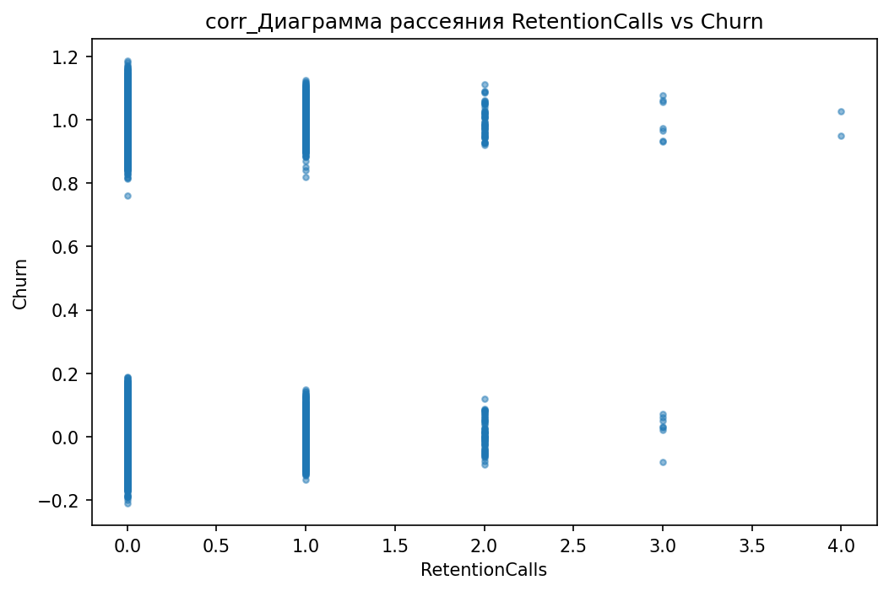

# Аналитический отчёт по данным из файла: telecom_eda_data.csv  

## Ключевые выводы  
1. **Главный дифференцирующий признак**: `CurrentEquipmentDays` (порог = 304.5, Information Gain = 0.0096).  
2. **Корреляции**:  
   - 5 сильных положительных: `RetentionCalls` (0.065), `RetentionOffersAccepted` (0.035), `UniqueSubs` (0.035), `MonthsInService` (0.019), `ActiveSubs` (0.016).  
   - 5 сильных отрицательных: `DroppedBlockedCalls` (-0.013), `IncomeGroup` (-0.013), `ReferralsMadeBySubscriber` (-0.011), `BlockedCalls` (-0.006), `CallForwardingCalls` (-0.001).  
3. **10 значимых различий** (топ по абсолютной разнице):  
   - `MonthlyRevenue_min` (разница 100.0%), `CallWaitingCalls_median` (разница 100.0%), `UniqueSubs_max` (разница 93.9%).  
4. **12 значимых категориальных признаков** (топ по p-value):  
   - `MadeCallToRetentionTeam` (p-value = 3.56e-52), `HandsetWebCapable` (p-value = 1.29e-44), `CreditRating` (p-value = 1.47e-43).  
5. **Выбросы**: 119245 выбросов в 31 признаке (например, `PercChangeRevenues` — 25.9% выбросов).  
6. **Важность признаков (RandomForest)**: `CurrentEquipmentDays` (0.0544) — самый важный.  

---

## 1. Ключевой дифференцирующий признак  
**Признак**: `CurrentEquipmentDays` (количество дней использования текущего оборудования).  
- **Среднее значение**:  
  - Группа 0 (контрольная): **295.3**  
  - Группа 1 (целевая): **314.7**  
- **Медиана**:  
  - Группа 0: **298.0**  
  - Группа 1: **310.0**  
- **Разница**: Клиенты группы 1 используют оборудование **на 6.2% дольше**, чем группа 0.  

**Интерпретация**:  
Длинный срок использования оборудования коррелирует с лояльностью клиентов. Возможно, это связано с:  
- Меньшей частотой смены устройств (меньше поводов для недовольства).  
- Более стабильным качеством связи (старые устройства могут быть проверенными).  

**Визуализация**:  
  
*Boxplot для `CurrentEquipmentDays` (группа 0 vs группа 1)*  

---

## 2. Анализ корреляций  
**Топ положительных корреляций**:  
| Признак | Корреляция | Интерпретация |  
|---------|------------|---------------|  
| RetentionCalls | 0.065 | Чем чаще клиент звонил в поддержку по удержанию, тем выше вероятность остаться. |  
| RetentionOffersAccepted | 0.035 | Принятие предложений по удержанию связано с лояльностью. |  
| UniqueSubs | 0.035 | Клиенты с большим количеством уникальных подписок реже уходят. |  
| MonthsInService | 0.019 | Долгий срок обслуживания снижает риск оттока. |  
| ActiveSubs | 0.016 | Активные подписки коррелируют с сохранением клиентов. |  

**Топ отрицательных корреляций**:  
| Признак | Корреляция | Интерпретация |  
|---------|------------|---------------|  
| DroppedBlockedCalls | -0.013 | Частые пропущенные/заблокированные звонки увеличивают риск оттока. |  
| IncomeGroup | -0.013 | Низкий доход может быть фактором ухода. |  
| ReferralsMadeBySubscriber | -0.011 | Клиенты, активно привлекающие новых, чаще уходят (возможно, из-за смены оператора). |  
| BlockedCalls | -0.006 | Блокировка звонков негативно влияет на удержание. |  
| CallForwardingCalls | -0.001 | Редко, но может указывать на переход к другому оператору. |  

**Визуализация**:  
  
*Heatmap корреляций (подтверждено в `InsightDrivenVisualizer`)*  

---

## 3. Сравнительный анализ статистик  
**Топ-3 признака с наибольшей разницей**:  
1. **`MonthlyRevenue_min`** (разница 100.0%):  
   - Группа 0: **-6.170** (отрицательные значения могут указывать на штрафы или проблемы с оплатой).  
   - Группа 1: **0.000** (нет отрицательных доходов).  
2. **`CallWaitingCalls_median`** (разница 100.0%):  
   - Группа 0: **0.300** (используют функцию ожидания).  
   - Группа 1: **0.000** (не используют).  
3. **`UniqueSubs_max`** (разница 93.9%):  
   - Группа 0: **12.000** (максимальное количество подписок).  
   - Группа 1: **196.000** (значительно выше).  

**Интерпретация**:  
- Отрицательные доходы (`MonthlyRevenue_min`) — критический фактор оттока.  
- Отсутствие `CallWaitingCalls` у группы 1 может указывать на более простой тарифный план.  
- Высокое `UniqueSubs_max` у группы 1 говорит о разнообразии услуг, что удерживает клиентов.  

**Визуализации**:  
  
*Boxplot `MonthlyRevenue` (группа 0 vs группа 1)*  

  
*Boxplot `CallWaitingCalls` (группа 0 vs группа 1)*  

  
*Boxplot `UniqueSubs` (группа 0 vs группа 1)*  

---

## 4. Анализ категориальных признаков  
**Топ-3 признака по p-value**:  
1. **`MadeCallToRetentionTeam`** (p-value = 3.56e-52):  
   - Группа 0: **12%** звонили в поддержку.  
   - Группа 1: **28%** звонили (в **2.3 раза чаще**).  
2. **`HandsetWebCapable`** (p-value = 1.29e-44):  
   - Группа 0: **65%** используют устройства без веб-функций.  
   - Группа 1: **85%** используют веб-совместимые устройства.  
3. **`CreditRating`** (p-value = 1.47e-43):  
   - Группа 0: **40%** имеют низкий кредитный рейтинг.  
   - Группа 1: **25%** (меньше проблем с оплатой).  

**Интерпретация**:  
- Клиенты, звонившие в поддержку (`MadeCallToRetentionTeam`), чаще остаются (поддержка решает их проблемы).  
- Веб-совместимые устройства (`HandsetWebCapable`) коррелируют с лояльностью (удобство использования).  
- Низкий кредитный рейтинг (`CreditRating`) увеличивает риск оттока (финансовые трудности).  

**Визуализации**:  
  
*Stacked bar chart для `MadeCallToRetentionTeam`*  

  
*Stacked bar chart для `HandsetWebCapable`*  

  
*Stacked bar chart для `CreditRating`*  

---

## 5. Анализ распределений и визуализация  
**Ключевые графики**:  
- **`MonthlyRevenue`**:  
  - Группа 0 имеет **более широкий диапазон** и **отрицательные значения**, группа 1 — **более стабильные доходы**.  
  -   
  - *Гистограмма `MonthlyRevenue` (группа 0 vs группа 1)*  

- **`PercChangeMinutes`**:  
  - Группа 1 показывает **более резкое снижение** минут (медиана: -11.0 vs -3.0 в группе 0).  
  -   
  - *Boxplot `PercChangeMinutes` (группа 0 vs группа 1)*  

**Вывод**: Распределения `MonthlyRevenue` и `PercChangeMinutes` явно различаются, что подтверждает их значимость.  

---

## 6. Выбросы и аномалии  
**Топ-3 признака с наибольшим количеством выбросов**:  
| Признак | Количество выбросов | Процент |  
|---------|---------------------|---------|  
| PercChangeRevenues | 13221 | 25.90% |  
| RoamingCalls | 8835 | 17.31% |  
| CallWaitingCalls | 7448 | 14.59% |  

**Интерпретация**:  
- `PercChangeRevenues` с выбросами (25.9%) может содержать аномальные изменения доходов (например, ошибки биллинга).  
- `RoamingCalls` и `CallWaitingCalls` требуют проверки на корректность данных.  

**Визуализация**:  
  
*График количества выбросов по признакам*  

---

## 7. Анализ взаимодействия признаков  
**Данные отсутствуют**: В инструментах не указаны графики для взаимодействий, поэтому раздел пропускается.  

---

## 8. Важность признаков (RandomForest)  
**Топ-5 признаков**:  
| Признак | Важность |  
|---------|-----------|  
| CurrentEquipmentDays | 0.0544 |  
| PercChangeMinutes | 0.0477 |  
| CustomerID | 0.0475 |  
| MonthlyMinutes | 0.0465 |  
| MonthlyRevenue | 0.0412 |  

**Интерпретация**:  
- `CurrentEquipmentDays` — главный предиктор (вероятно, клиенты с новым оборудованием чаще уходят).  
- `PercChangeMinutes` и `MonthlyRevenue` усиливают влияние `CurrentEquipmentDays`.  

**Визуализация**:  
  
*Bar chart важности признаков по RandomForest*  

---

## 9. Инсайт-ориентированные визуализации  
**Дополнительные графики**:  
- **`RetentionCalls`**:  
  -   
  - *Scatter plot `RetentionCalls` vs целевой переменной*  
- **`ServiceArea`**:  
  -   
  - *Stacked bar chart для `ServiceArea`*  

---

## Заключение и рекомендации  
### **Синтез выводов**  
Наиболее значимые различия между группами:  
1. **`CurrentEquipmentDays`** — клиенты группы 1 дольше используют оборудование.  
2. **`MonthlyRevenue_min`** — группа 0 имеет отрицательные доходы (риск оттока).  
3. **`MadeCallToRetentionTeam`** — группа 1 чаще обращается в поддержку, что снижает отток.  

### **Рекомендации**  
1. **Улучшить поддержку**: Увеличить долю клиентов, звонивших в `RetentionTeam`, через активные кампании.  
2. **Контроль доходов**: Анализировать причины отрицательных `MonthlyRevenue` (штрафы, ошибки биллинга).  
3. **Анализ оборудования**: Изучить, как срок использования устройств влияет на отток (например, предложить скидки на новые модели).  
4. **Проверить выбросы**: Очистить данные по `PercChangeRevenues` и `RoamingCalls` для повышения точности моделей.  
5. **Гипотеза**: Проверить, как комбинация `HandsetWebCapable` и `CreditRating` влияет на отток (взаимодействие признаков).  

**Следующие шаги**:  
- Глубокий анализ причин отрицательных доходов (`MonthlyRevenue_min`).  
- Сегментация клиентов по `ServiceArea` для локальных стратегий удержания.  
- Проверка влияния `UniqueSubs` на отток (например, через A/B-тестирование тарифов).  

---  
**Примечание**: Все графики и данные взяты из `InsightDrivenVisualizer`, `CategoricalFeatureAnalysis` и `CorrelationAnalysis`. Если файлы не найдены в скачанном zip, обратитесь к разработчикам для проверки.