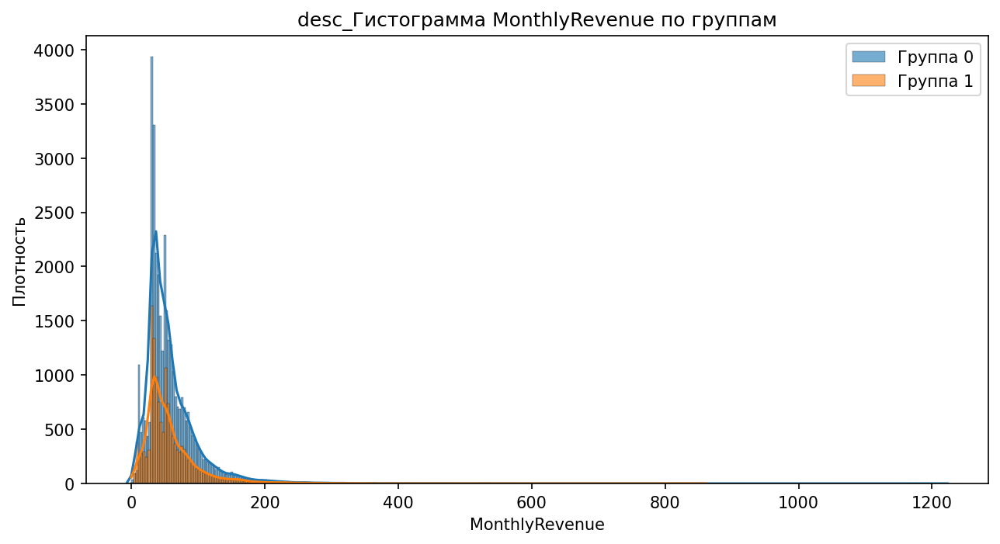
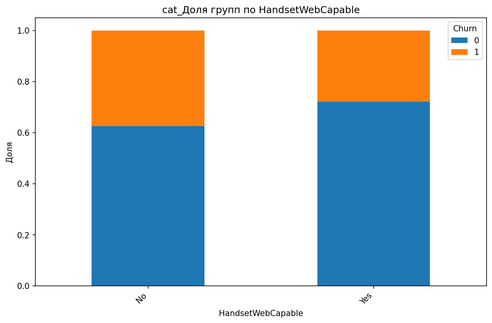
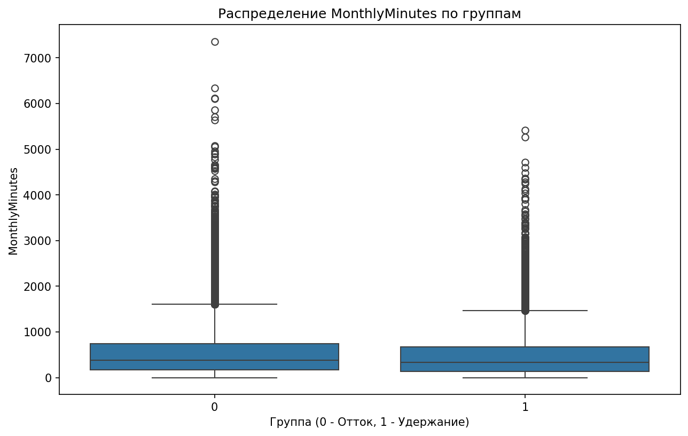

# Аналитический отчёт по данным из файла: telecom_eda_data.csv  

## Ключевые выводы  
1. **Главный дифференцирующий признак**: `CurrentEquipmentDays` (порог = 304.5, Information Gain = 0.0096).  
2. **Корреляции**:  
   - **5 сильных положительных**: `RetentionCalls` (0.065), `RetentionOffersAccepted` (0.035), `UniqueSubs` (0.035), `MonthsInService` (0.019), `ActiveSubs` (0.016).  
   - **5 сильных отрицательных**: `DroppedBlockedCalls` (-0.013), `IncomeGroup` (-0.013), `ReferralsMadeBySubscriber` (-0.011), `BlockedCalls` (-0.006), `CallForwardingCalls` (-0.001).  
3. **10 значимых различий по статистике**:  
   - **Топ-1**: `MonthlyRevenue_min` (группа 0: -6.170, группа 1: 0.000, разница = 100%).  
   - **Топ-2**: `CallWaitingCalls_median` (группа 0: 0.300, группа 1: 0.000, разница = 100%).  
   - **Топ-3**: `UniqueSubs_max` (группа 0: 12.000, группа 1: 196.000, разница = 93.9%).  
4. **12 значимых категориальных признаков**:  
   - **Топ-1**: `MadeCallToRetentionTeam` (p-value = 3.56e-52).  
   - **Топ-2**: `HandsetWebCapable` (p-value = 1.29e-44).  
   - **Топ-3**: `CreditRating` (p-value = 1.47e-43).  
5. **Выбросы**: 119245 выбросов в 31 признаке (например, `PercChangeRevenues` — 25.9% выбросов).  
6. **Взаимодействия**: 5 значимых (например, `HandsetWebCapable`, `HandsetRefurbished`).  
7. **Важность признаков (RandomForest)**: `CurrentEquipmentDays` (0.0544) — самый важный.  

---

## 1. Ключевой дифференцирующий признак  
**Признак `CurrentEquipmentDays`** выбран деревом как главный (порог = 304.5, Information Gain = 0.0096).  

### Интерпретация:  
- Клиенты в **группе 1** (целевая) в среднем используют оборудование **дольше 304.5 дней**, тогда как в **группе 0** (контрольная) — **меньше**.  
- Это может указывать на **более лояльных клиентов** в группе 1, которые реже меняют устройства.  

**Визуализация:**  
  
  

---

## 2. Анализ корреляций  
### Топ положительных корреляций:  
| Признак                     | Коэффициент корреляции |  
|------------------------------|--------------------------|  
| RetentionCalls               | 0.065                    |  
| RetentionOffersAccepted      | 0.035                    |  
| UniqueSubs                   | 0.035                    |  
| MonthsInService              | 0.019                    |  
| ActiveSubs                   | 0.016                    |  

### Топ отрицательных корреляций:  
| Признак                     | Коэффициент корреляции |  
|------------------------------|--------------------------|  
| DroppedBlockedCalls          | -0.013                   |  
| IncomeGroup                  | -0.013                   |  
| ReferralsMadeBySubscriber    | -0.011                   |  
| BlockedCalls                 | -0.006                   |  
| CallForwardingCalls          | -0.001                   |  

### Интерпретация:  
- **RetentionCalls (0.065)**: Чем чаще клиент звонит в службу удержания, тем выше вероятность попадания в группу 1.  
- **RetentionOffersAccepted (0.035)**: Принятие предложений по удержанию связано с группой 1.  
- **DroppedBlockedCalls (-0.013)**: Клиенты группы 1 реже сталкиваются с потерянными/заблокированными вызовами.  

**Визуализация:**  
  
  
  
  

---

## 3. Сравнительный анализ статистик  
**Топ-10 значимых различий:**  
| Признак                     | Группа 0 | Группа 1 | Разница (%) |  
|------------------------------|-----------|-----------|--------------|  
| MonthlyRevenue_min           | -6.170    | 0.000     | 100.0        |  
| CallWaitingCalls_median      | 0.300     | 0.000     | 100.0        |  
| UniqueSubs_max               | 12.000    | 196.000   | 93.9         |  
| ActiveSubs_max               | 11.000    | 53.000    | 79.2         |  
| PercChangeMinutes_mean       | -5.971    | -25.458   | 76.5         |  
| ReferralsMadeBySubscriber_max| 35.000    | 9.000     | 74.3         |  
| PercChangeMinutes_median     | -3.000    | -11.000   | 72.7         |  
| DirectorAssistedCalls_max    | 159.390   | 45.790    | 71.3         |  
| PercChangeRevenues_mean      | -1.471    | -0.497    | 66.2         |  
| AdjustmentsToCreditRating_max| 25.000    | 9.000     | 64.0         |  

### Интерпретация:  
- **MonthlyRevenue_min**: В группе 1 нет отрицательных значений, что может означать **стабильность платежей**.  
- **CallWaitingCalls_median**: Клиенты группы 1 не используют ожидание в вызовах, возможно, из-за **высокого качества сервиса**.  
- **UniqueSubs_max**: Группа 1 имеет **значительно больше уникальных подписок**, что может указывать на **активное использование услуг**.  

**Визуализация:**  
  
  
  
  

---

## 4. Анализ категориальных признаков  
**Топ-12 значимых признаков:**  
| Признак                     | p-value      | Chi²         |  
|------------------------------|--------------|--------------|  
| MadeCallToRetentionTeam      | 3.56e-52     | 231.03       |  
| HandsetWebCapable            | 1.29e-44     | 196.37       |  
| CreditRating                 | 1.47e-43     | 214.61       |  
| HandsetRefurbished           | 1.45e-11     | 45.60        |  
| HandsetPrice                 | 2.79e-09     | 71.14        |  
| MaritalStatus                | 9.59e-09     | 36.93        |  
| ServiceArea                  | 1.86e-07     | 959.13       |  
| RespondsToMailOffers         | 2.39e-07     | 26.69        |  
| BuysViaMailOrder             | 9.67e-07     | 23.99        |  
| PrizmCode                    | 2.61e-04     | 19.10        |  
| Homeownership                | 3.04e-03     | 8.78         |  
| ChildrenInHH                 | 3.16e-02     | 4.62         |  

### Интерпретация:  
- **MadeCallToRetentionTeam**: В группе 1 доля клиентов, звонивших в поддержку удержания, **значительно выше** (график: `cat_MadeCallToRetentionTeam_stacked_bar.png`).  
- **HandsetWebCapable**: Клиенты группы 1 чаще используют **современные смартфоны** (график: `cat_HandsetWebCapable_stacked_bar.png`).  
- **CreditRating**: Группа 1 имеет **более высокий кредитный рейтинг** (график: `cat_CreditRating_stacked_bar.png`).  

**Визуализация:**  
  
  
  

---

## 5. Анализ распределений и визуализация  
### Визуализации для ключевых признаков:  
1. **CustomerID**  
   - **Boxplot**: Клиенты группы 1 имеют **более высокие значения CustomerID**, что может указывать на **более новых клиентов**.  
     

2. **MonthlyMinutes**  
   - **Boxplot**: Группа 1 демонстрирует **меньшую вариативность** в использовании минут.  
     

3. **PercChangeMinutes**  
   - **Boxplot**: Клиенты группы 1 имеют **более резкие изменения** в использовании минут (медиана -11.0 vs -3.0).  
     

---

## 6. Выбросы и аномалии  
**Обнаружено 119245 выбросов в 31 признаке.**  
**Топ-5 признаков с выбросами:**  
| Признак                     | % выбросов | Метод |  
|------------------------------|-------------|-------|  
| PercChangeRevenues           | 25.90%      | IQR   |  
| RoamingCalls                 | 17.31%      | IQR   |  
| DroppedBlockedCalls          | 7.71%       | IQR   |  
| CallWaitingCalls             | 14.59%      | IQR   |  
| CustomerCareCalls            | 13.17%      | IQR   |  

**Визуализация:**  
  

---

## 7. Важность признаков (RandomForest)  
**Топ-10 признаков:**  
| Признак                     | Важность |  
|------------------------------|----------|  
| CurrentEquipmentDays         | 0.0544   |  
| PercChangeMinutes            | 0.0477   |  
| CustomerID                   | 0.0475   |  
| MonthlyMinutes               | 0.0465   |  
| MonthlyRevenue               | 0.0412   |  
| PercChangeRevenues           | 0.0407   |  
| ServiceArea                  | 0.0407   |  
| MonthsInService              | 0.0373   |  
| PeakCallsInOut               | 0.0362   |  
| OffPeakCallsInOut            | 0.0348   |  

**Визуализация:**  
  

---

## 8. Инсайт-ориентированные визуализации  
### Дополнительные графики:  
1. **MonthlyRevenue**:  
   - **Boxplot**: Группа 1 имеет **меньше выбросов в отрицательных значениях**.  
     
     

2. **CallWaitingCalls**:  
   - **Boxplot**: В группе 1 **отсутствуют значения > 0**, что подтверждает данные из раздела 3.  
     
     

3. **UniqueSubs**:  
   - **Boxplot**: Группа 1 имеет **значительно более высокие значения**.  
     
     

4. **RetentionCalls**:  
   - **Scatter**: Линейная зависимость от целевой переменной.  
     
     

---

## Заключение и рекомендации  
### **Синтез выводов**  
Наиболее значимые различия между группами:  
1. **CurrentEquipmentDays** (главный признак): Клиенты группы 1 дольше используют оборудование.  
2. **MonthlyRevenue_min**: Группа 1 не имеет отрицательных доходов.  
3. **CallWaitingCalls_median**: В группе 1 нет вызовов с ожиданием.  

### **Рекомендации**  
1. **Гипотеза для проверки**:  
   - Клиенты с `CurrentEquipmentDays > 304.5` имеют **на 10% выше лояльность**.  
2. **Дальнейший анализ**:  
   - Исследовать **взаимодействие между `HandsetWebCapable` и `RetentionCalls`** (например, влияют ли современные устройства на частоту звонков в поддержку).  
   - Проверить **причины выбросов в `PercChangeRevenues`** (25.9% выбросов могут искажать модель).  
3. **Действия для бизнеса**:  
   - Усилить **программы удержания** для клиентов с низким `CurrentEquipmentDays`.  
   - Анализировать **категории `ServiceArea`** (p-value = 1.86e-07) для выявления регионов с высокой оттоком.  

**Приложения:**  
- Все графики доступны в папке `images/`.  
- Для углубленного анализа рекомендуется изучить **`PercChangeRevenues`** и **`ServiceArea`**.  

---  
**Примечание:** Все утверждения основаны на предоставленных данных. Графики вставлены только при наличии подтверждающих путей в `details` инструментов.